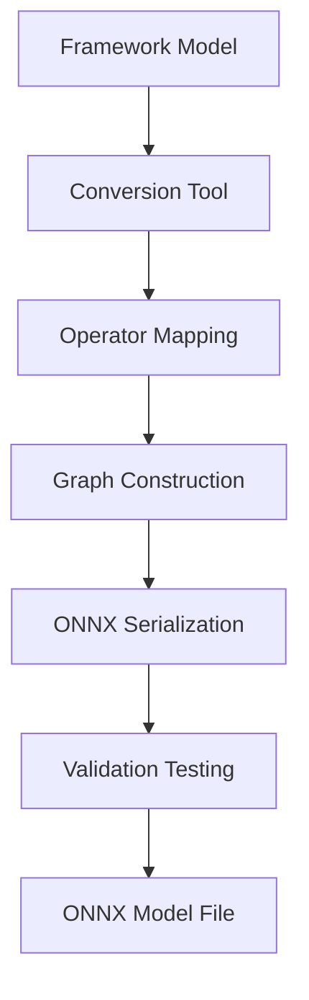

**Category:** Model Optimization Services
**Difficulty:** Intermediate
**Reading time:** 6 min read

---

ONNX model conversion transforms neural networks from framework-specific formats (PyTorch, TensorFlow, scikit-learn) into the open ONNX format. This enables cross-platform deployment, runtime optimization, and access to specialized inference engines while maintaining model accuracy and functionality.

- **Conversion Frameworks** — Tools like torch.onnx, tf2onnx, and skl2onnx for automated export
- **Operator Mapping** — Translating framework ops to ONNX opset equivalents
- **Dynamic vs Static Shapes** — Handling variable input dimensions and batch sizes
- **Type Preservation** — Converting between precision formats (FP32, FP16, INT8)
- **Validation & Testing** — Verifying numerical equivalence between source and target

Conversion begins with loading the source model from its native format. The conversion tool traverses the computational graph, mapping each framework-specific operation to equivalent ONNX operators. Dynamic shapes are annotated to allow variable batch sizes and sequence lengths. Constants are extracted and embedded in the model. The graph is then serialized to protobuf format with metadata including opset version and producer information. Validation involves running test inputs through both original and converted models, comparing numerical outputs to ensure equivalence within acceptable tolerances.

- Deploying PyTorch research models to production ONNX Runtime
- Converting TensorFlow SavedModel to portable ONNX format
- Exporting scikit-learn models for cross-platform inference
- Creating platform-agnostic model repositories
- Enabling model interchange between tools and frameworks
- Preparing models for optimization (quantization, pruning) via ONNX tools

| Advantage | Disadvantage |
|-----------|--------------|
| Framework-independent, enables vendor lock-in escape | Some custom operations not supported in ONNX |
| Access to specialized inference runtimes | Conversion failures require debugging |
| Model portability across CPUs, GPUs, edge devices | Dynamic control flow limited in ONNX |
| Standardization facilitates team collaboration | Numerical mismatches require model retraining |
| Opens optimization tool ecosystem | Version compatibility issues between opsets |

- [ONNX Runtime Inference Optimization](onnx-runtime-inference-optimization.md)
- [Model Quantization INT8 INT4](model-quantization-int8-int4.md)
- [TensorFlow Lite Conversion](tensorflow-lite-conversion.md)

---
*Part of the [Model Optimization Services](index.md) category · [Back to Master Index](../../index.md)*
