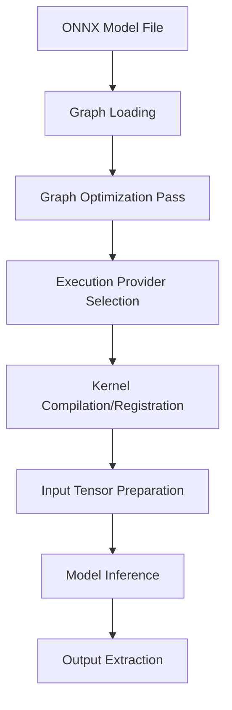

**Category:** Model Optimization Services
**Difficulty:** Intermediate
**Reading time:** 6 min read

---

ONNX Runtime is a high-performance inference engine that executes ONNX (Open Neural Network Exchange) models across CPUs, GPUs, and specialized accelerators. It provides graph optimization, kernel fusion, and hardware-specific execution paths to maximize throughput while minimizing latency and memory consumption.

- **ONNX Format** — Platform-agnostic serialization for neural networks enabling portability
- **Graph Optimization** — Constant folding, operator fusion, and dead code elimination
- **Execution Providers** — Hardware-specific backends (CPU, CUDA, TensorRT, CoreML, NNAPI)
- **Session Configuration** — Tuning memory, threading, and optimization levels for workloads
- **Quantized Execution** — Native support for INT8 and mixed-precision inference

ONNX Runtime loads serialized model graphs and performs compile-time optimizations including constant propagation, operator fusion (combining adjacent ops into single kernels), and memory layout optimization. The runtime selects the best execution provider based on available hardware and operator support—CUDA for NVIDIA GPUs, CoreML for Apple devices, or CPU for universal fallback. During inference, input tensors are mapped to the device memory space, the optimized graph executes, and outputs are returned. The system manages memory allocation, handles asynchronous execution, and provides profiling hooks to identify bottlenecks.

- High-throughput serving of computer vision models
- Edge device inference on mobile and IoT
- Latency-sensitive real-time inference (autonomous vehicles, robotics)
- Cost-effective GPU inference across multiple hardware types
- Model agnostic deployment of PyTorch, TensorFlow, or scikit-learn models
- Batch processing pipelines requiring multi-framework support

| Advantage | Disadvantage |
|-----------|--------------|
| Supports multiple frameworks & hardware targets | Limited to ONNX-compatible operators |
| Excellent operator fusion & graph optimization | Custom operators require C++ implementation |
| Strong GPU support across vendor ecosystems | Learning curve for execution provider config |
| Production-grade stability & performance | Smaller community than framework-native runtimes |
| Cross-platform portability | Debugging optimized graphs more difficult |

- [ONNX Model Conversion](onnx-model-conversion.md)
- [TensorRT Model Optimization](tensorrt-model-optimization.md)
- [Model Quantization INT8 INT4](model-quantization-int8-int4.md)

---
*Part of the [Model Optimization Services](index.md) category · [Back to Master Index](../../index.md)*
