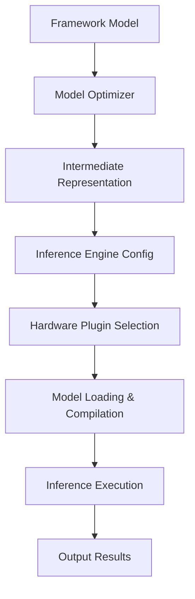

**Category:** Model Optimization Services
**Difficulty:** Intermediate
**Reading time:** 6 min read

---

OpenVINO (Open Visual Inference and Neural network Optimization) is Intel's toolkit for optimizing and deploying deep learning models across CPUs, GPUs, and specialized hardware. It provides model optimization, hardware-agnostic inference, and edge deployment capabilities with minimal code changes.

- **Intermediate Representation (IR)** — OpenVINO's framework-agnostic model format
- **Model Optimizer** — Converts models from various frameworks to IR
- **Inference Engine** — Cross-platform runtime executing optimized models
- **Hardware Plugins** — CPU, GPU, FPGA, Movidius backends for different devices
- **Quantization Tools** — Post-training and quantization-aware optimization

The Model Optimizer converts TensorFlow, PyTorch, ONNX, or Caffe models to OpenVINO's IR format, a language-neutral representation of the computational graph. The IR includes optimization metadata and can be compressed through quantization. The Inference Engine loads IR models, compiles them for the target hardware (CPU uses specialized AVX/SSE kernels, GPU uses OpenCL), and optimizes for execution. Plugins abstract hardware differences, allowing the same code to run on Intel CPUs, discrete GPUs, or edge accelerators like Movidius. The inference runtime handles memory management, supports dynamic batching, and provides performance profiling.

- Edge device inference on Intel processors
- Heterogeneous computing across CPU and GPU
- Computer vision applications at edge and cloud
- Autonomous driving perception pipelines
- Industrial IoT and smart camera deployments
- Multi-hardware inference with single codebase

| Advantage | Disadvantage |
|-----------|--------------|
| Cross-platform hardware support with unified API | Smaller ecosystem than TensorFlow or PyTorch |
| Excellent edge device optimization | Model Optimizer has framework version dependencies |
| Good quantization and optimization tools | Less documentation than competing platforms |
| Strong Intel hardware support & performance | Community smaller than mainstream frameworks |
| Open-source with active development | Limited custom operator support |

- [OpenVINO Model Optimizer](openvino-model-optimizer.md)
- [Model Quantization INT8 INT4](model-quantization-int8-int4.md)
- [ONNX Runtime Inference Optimization](onnx-runtime-inference-optimization.md)

---
*Part of the [Model Optimization Services](index.md) category · [Back to Master Index](../../index.md)*
