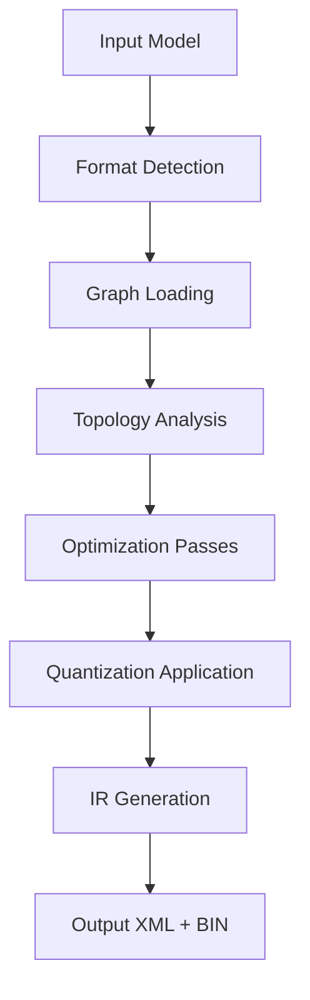

**Category:** Model Optimization Services
**Difficulty:** Intermediate
**Reading time:** 6 min read

---

The OpenVINO Model Optimizer is a command-line tool that converts neural network models from various frameworks (TensorFlow, PyTorch, ONNX, Caffe) to OpenVINO's Intermediate Representation format. It applies graph-level optimizations and produces deployment-ready models with reduced footprint and improved inference performance.

- **Framework Support** — Handles TensorFlow, PyTorch, Caffe, MXNet model formats
- **Graph Optimization** — Constant folding, dead code elimination, and fusion
- **Quantization Integration** — Applies INT8 quantization during conversion
- **Input Shape Management** — Configures static and dynamic input dimensions
- **Model Validation** — Ensures numerical equivalence with original models

The Model Optimizer detects the input framework and loads the model graph. It analyzes node connectivity and data types, identifying optimization opportunities. Constant folding pre-computes static computations at conversion time. Operation fusion merges compatible nodes into single operations. If quantization is specified, the tool applies INT8 scaling factors. The optimized graph is serialized to XML (topology) and BIN (weights) files forming the IR. Metadata includes opset version, precision information, and layout hints for inference engine backends.

- Batch converting enterprise model repositories to OpenVINO format
- Preparing models for edge deployment on Intel hardware
- Applying quantization to reduce model size
- Supporting model zoo distribution and standardization
- Continuous integration pipelines for model compilation
- Research team model consolidation

| Advantage | Disadvantage |
|-----------|--------------|
| Single tool for multi-framework conversion | Framework version dependencies |
| Built-in quantization and optimization | Some operators not supported |
| XML+BIN format lightweight & portable | Conversion failures require debugging |
| CLI and Python API for automation | Limited custom operation support |
| Preserves model accuracy for most cases | Complex dynamic shapes challenging |

- [OpenVINO Inference Toolkit](openvino-inference-toolkit.md)
- [ONNX Model Conversion](onnx-model-conversion.md)
- [Post-training Quantization PTQ](post-training-quantization-ptq.md)

---
*Part of the [Model Optimization Services](index.md) category · [Back to Master Index](../../index.md)*
