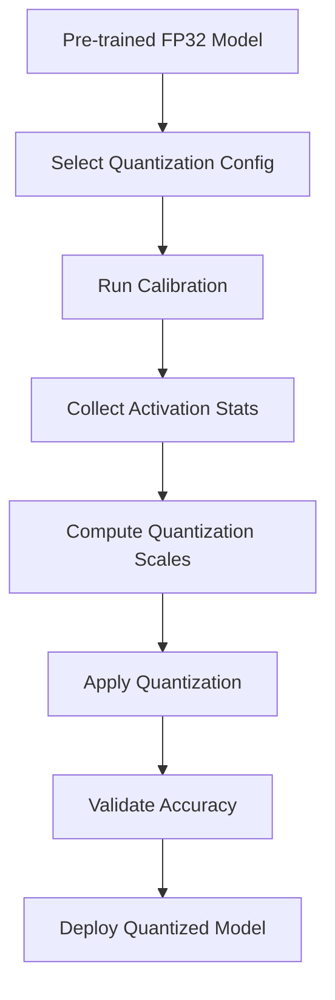

**Category:** Model Optimization Services
**Difficulty:** Intermediate
**Reading time:** 6 min read

---

Post-training quantization applies INT8 or INT4 precision to pre-trained FP32 models without retraining, enabling rapid deployment optimization. PTQ requires minimal effort and works with most model architectures, though it may sacrifice accuracy on highly quantization-sensitive models.

- **Calibration Dataset** — Representative data for computing activation statistics
- **Scale Computation** — Determining optimal quantization parameters
- **Bias Correction** — Adjusting biases to compensate for quantization error
- **Per-Layer vs Per-Channel** — Different granularities for scale computation
- **Validation & Tuning** — Assessing accuracy impact and layer-specific adjustments

PTQ begins with a fully trained FP32 model and a calibration dataset of representative samples. The model runs in inference mode while hooks record activation ranges (min/max or histograms) for each layer. Calibration methods (min-max, entropy, percentile) compute optimal quantization scales minimizing information loss. Per-channel quantization applies different scales to different weight dimensions. Bias correction adjusts layer biases to compensate for quantization-introduced errors. The quantized model replaces FP32 weights with INT8 equivalents and inserts quantization/dequantization operations at layer boundaries. Post-quantization validation measures accuracy degradation and may require fine-tuning or mixed-precision selection.

- Quick model optimization for legacy systems
- Lightweight quantization without retraining
- Batch quantizing large model repositories
- A/B testing quantization impact
- Cost-sensitive inference at scale
- Rapid prototyping of quantized deployment

| Advantage | Disadvantage |
|-----------|--------------|
| No retraining required, fast turnaround | Accuracy loss greater than QAT for sensitive models |
| Works with frozen, production models | Requires calibration dataset |
| Simple workflow, minimal code changes | Less control than quantization-aware training |
| Suitable for most standard architectures | May need fine-tuning for complex models |
| Framework-agnostic tools available | Hardware support varies |

- [Quantization-Aware Training QAT](quantization-aware-training-qat.md)
- [Model Quantization INT8 INT4](model-quantization-int8-int4.md)
- [GPTQ Quantization](gptq-quantization.md)

---
*Part of the [Model Optimization Services](index.md) category · [Back to Master Index](../../index.md)*
