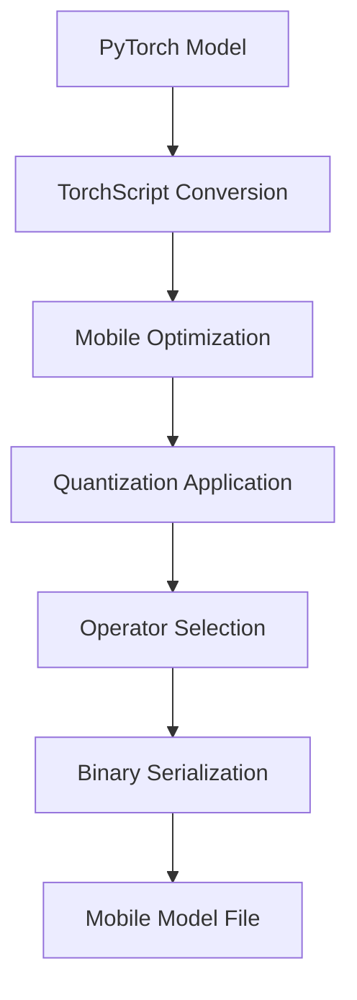

**Category:** Model Optimization Services
**Difficulty:** Intermediate
**Reading time:** 6 min read

---

PyTorch Mobile enables efficient deployment of PyTorch models on iOS and Android devices through model optimization, lightweight runtime, and hardware acceleration support. It reduces model size and inference latency while maintaining compatibility with the PyTorch ecosystem.

- **TorchScript** — Intermediate representation for deployment without Python dependency
- **Module Optimization** — Conv/BatchNorm folding and dead code elimination
- **Operator Reduction** — Selecting minimal op set for size and performance
- **Quantization Integration** — INT8 and dynamic quantization for mobile
- **Hardware Acceleration** — GPU and specialized processors (Metal, NNAPI)

PyTorch models are converted to TorchScript, removing Python dependencies and enabling static analysis. The mobile optimizer performs graph-level transformations: fusing consecutive operations (conv+relu+pooling), eliminating unused tensors, and selecting the minimal operator set. Quantization can be applied to reduce precision. The optimized model is serialized to a binary format compatible with mobile runtimes. iOS uses Metal for GPU acceleration while Android supports NNAPI for hardware-backed inference. The lightweight runtime (~2-3MB) loads models efficiently and manages memory for mobile constraints.

- On-device computer vision (object detection, segmentation, pose estimation)
- Real-time natural language processing on phones
- Privacy-sensitive biometric inference
- Offline-capable mobile applications
- Low-latency interactive AI experiences
- Battery-efficient continuous monitoring

| Advantage | Disadvantage |
|-----------|--------------|
| Tight PyTorch integration, easy model export | Smaller community vs TensorFlow Lite |
| Strong GPU acceleration on mobile | Limited operator coverage vs desktop PyTorch |
| Quantization native to PyTorch | Android NNAPI support inconsistent |
| Good documentation and examples | Fewer third-party tools and libraries |
| Open-source with active development | Debugging on-device inference challenging |

- [PyTorch Quantization](pytorch-quantization.md)
- [TensorFlow Lite Conversion](tensorflow-lite-conversion.md)
- [Model Quantization INT8 INT4](model-quantization-int8-int4.md)

---
*Part of the [Model Optimization Services](index.md) category · [Back to Master Index](../../index.md)*
