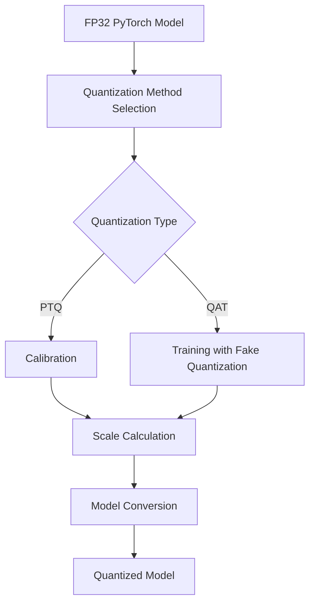

**Category:** Model Optimization Services
**Difficulty:** Intermediate
**Reading time:** 6 min read

---

PyTorch quantization converts FP32 models to lower precision (INT8, FP16) through post-training or quantization-aware training, achieving 3-4x model size reduction and 2-3x speedup. PyTorch provides multiple quantization schemes with framework-integrated training and inference.

- **Post-Training Dynamic Quantization** — Simplest approach, quantizes weights offline
- **Post-Training Static Quantization** — Requires calibration dataset for activation ranges
- **Quantization-Aware Training** — Fine-tunes during training for optimal low-precision performance
- **Qat Conversion** — Transforms QAT models for deployment without training artifacts
- **Custom Quantization** — Fine-grained control over per-layer and per-channel settings

PyTorch quantization operates at the module level, replacing FP32 operations with quantized equivalents. Post-training quantization analyzes activation ranges by running inference on calibration data, computing per-layer or per-channel scales. Quantization-aware training inserts fake quantization ops during forward/backward passes, simulating INT8 behavior while preserving gradient information. The model learns to minimize accuracy loss at reduced precision. After training, the fake quantization is folded into weights and scales. During inference, quantized operations execute directly without dequantization, reducing memory and compute.

- Deploying PyTorch models to mobile devices via PyTorch Mobile
- Cloud inference optimization and cost reduction
- Edge device deployment with resource constraints
- Real-time inference for latency-sensitive applications
- Model compression for storage and transmission
- Fine-tuning production models for efficiency

| Advantage | Disadvantage |
|-----------|--------------|
| Fully integrated into PyTorch workflow | Requires framework-specific tooling |
| Flexible quantization schemes for different needs | QAT requires retraining model |
| Good documentation and examples | Accuracy degradation varies by model |
| Supports distributed quantization-aware training | Limited mixed-precision quantization |
| Compatible with other PyTorch optimization | Debugging numerical issues challenging |

- [PyTorch Mobile Optimization](pytorch-mobile-optimization.md)
- [Quantization-Aware Training QAT](quantization-aware-training-qat.md)
- [Post-training Quantization PTQ](post-training-quantization-ptq.md)

---
*Part of the [Model Optimization Services](index.md) category · [Back to Master Index](../../index.md)*
