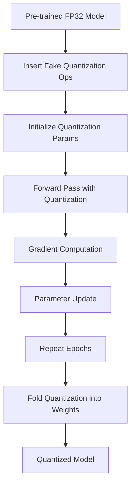

**Category:** Model Optimization Services
**Difficulty:** Intermediate
**Reading time:** 6 min read

---

Quantization-Aware Training simulates quantization during model training, allowing neural networks to adapt to reduced precision and minimize accuracy loss. QAT typically achieves better accuracy than post-training quantization but requires retraining time and computational resources.

- **Fake Quantization** — Simulates INT8/INT4 behavior during training without actual quantization
- **Learnable Scales** — Quantization parameters optimized during gradient descent
- **Gradient Flow** — Straight-through estimators for backpropagation through quantization
- **Layer Freezing** — Options to freeze early layers while quantizing others
- **Fine-tuning** — Short training runs to adapt pre-trained models to quantization

QAT begins by inserting fake quantization operations into the model graph that simulate quantization without actually changing precision. During forward passes, activations are quantized to INT8 and immediately dequantized, simulating true quantization effects. Quantization parameters (scales and zero-points) are learnable tensors optimized via gradient descent. The straight-through estimator approximates gradients through non-differentiable quantization operations. Training continues until convergence, allowing the model to learn weight distributions and layer representations that minimize loss under quantization. After training, fake quantization is folded into weights, producing a deployment-ready quantized model without training artifacts.

- High-accuracy quantized models for critical applications
- Quantizing sensitive architectures with significant FP32 loss
- Fine-tuning pre-trained models for quantization
- Enterprise model optimization pipelines
- Research into quantization-robust architectures
- Production models with strict accuracy requirements

| Advantage | Disadvantage |
|-----------|--------------|
| Better accuracy than post-training quantization | Requires retraining (hours to days) |
| Learns quantization-optimal weight distributions | Computational overhead during training |
| Flexible layer-level quantization control | Complex gradient flow implementation |
| Works well for most model architectures | Debugging training dynamics challenging |
| Framework-native support in PyTorch/TensorFlow | Hyperparameter tuning needed per model |

- [Post-training Quantization PTQ](post-training-quantization-ptq.md)
- [Model Quantization INT8 INT4](model-quantization-int8-int4.md)
- [PyTorch Quantization](pytorch-quantization.md)

---
*Part of the [Model Optimization Services](index.md) category · [Back to Master Index](../../index.md)*
