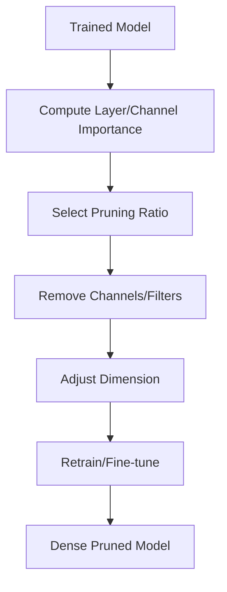

**Category:** Model Optimization Services
**Difficulty:** Intermediate
**Reading time:** 6 min read

---

Structured pruning removes entire output channels, filters, or blocks from neural networks, resulting in dense matrices compatible with standard hardware acceleration. Unlike unstructured pruning, structured pruning enables actual speedups on CPUs, GPUs, and edge accelerators without specialized sparse tensor libraries.

- **Channel Pruning** — Removes entire output channels from convolutional layers
- **Filter Pruning** — Removes filters affecting multiple layers
- **Block Pruning** — Removes entire blocks (attention heads, transformer layers)
- **Group Sparsity** — Selects which groups of weights to remove jointly
- **Layer Importance** — Identifying which layers contribute least to output

Structured pruning analyzes importance of entire channels or filters through metrics like magnitude, gradient, or learned scores. Channels with lowest importance scores are marked for removal. The corresponding input dimension in the next layer is also adjusted—if a layer's output channel is pruned, the next layer's input dimension shrinks. The model remains fully dense with reduced feature dimensions. Fine-tuning recovers accuracy by allowing remaining weights to adapt. Structured pruning directly reduces FLOPS and memory access, enabling acceleration on standard hardware without sparse tensor support.

- Mobile inference acceleration (iOS, Android)
- CPU inference optimization
- Edge device deployment
- Real-time inference latency reduction
- Hardware-aware model compression
- Production model deployment

| Advantage | Disadvantage |
|-----------|--------------|
| Hardware-compatible speedups (no special libs) | Less extreme compression than unstructured |
| Works on CPUs, GPUs, specialized processors | Requires careful importance metric selection |
| Maintains dense matrix operations | Fine-tuning necessary for accuracy |
| Good for latency-critical applications | Limited flexibility in pruning patterns |
| Reduces memory access patterns | May require architecture redesign |

- [Unstructured Pruning](unstructured-pruning.md)
- [Model Pruning Techniques](model-pruning-techniques.md)
- [Knowledge Distillation](knowledge-distillation.md)

---
*Part of the [Model Optimization Services](index.md) category · [Back to Master Index](../../index.md)*
