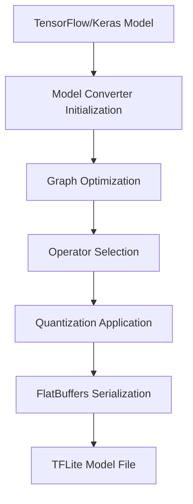

**Category:** Model Optimization Services
**Difficulty:** Intermediate
**Reading time:** 6 min read

---

TensorFlow Lite conversion transforms full TensorFlow or Keras models into optimized FlatBuffers format for mobile and edge deployment. The conversion process reduces model size by 50-90% and enables inference on phones, microcontrollers, and IoT devices with minimal dependencies.

- **TFLite Format** — Flat binary format optimized for mobile and embedded
- **Graph Optimization** — Removes unused ops and fuses compatible operations
- **Quantization Support** — INT8, dynamic quantization, and hybrid approaches
- **Operator Subset** — Limited ops vs full TensorFlow for smaller binary
- **Metadata Embedding** — Includes preprocessing, output labels, and versioning

The TFLite converter loads SavedModel or Keras model artifacts and analyzes the computational graph. It selects the minimal set of operations needed for inference, excluding training-only ops. Graph optimization removes dead code and fuses adjacent operations. Quantization (if enabled) calculates per-tensor scaling factors. The optimized graph is serialized using FlatBuffers, a space-efficient format with fast random access. The output .tflite file includes metadata sections for model versioning, operation signatures, and optional preprocessing/postprocessing descriptions.

- Mobile app deep learning (image recognition, NLP, pose detection)
- Wearable device inference (watches, fitness trackers)
- Microcontroller inference (Arduino, embedded Linux)
- On-device privacy-preserving inference
- Offline-capable mobile applications
- Reduced bandwidth requirements in IoT networks

| Advantage | Disadvantage |
|-----------|--------------|
| Extremely compact model size (MB to KB) | Limited operator coverage vs TensorFlow |
| Fast inference on mobile hardware | Conversion failures for complex models |
| No external dependencies on device | Debugging requires specific TFLite tooling |
| Hardware acceleration support (GPU, NPU) | Dynamic shapes and control flow limited |
| Open format with community tools | Smaller ecosystem than full TensorFlow |

- [TensorFlow Lite Quantization](tensorflow-lite-quantization.md)
- [PyTorch Mobile Optimization](pytorch-mobile-optimization.md)
- [Model Quantization INT8 INT4](model-quantization-int8-int4.md)

---
*Part of the [Model Optimization Services](index.md) category · [Back to Master Index](../../index.md)*
