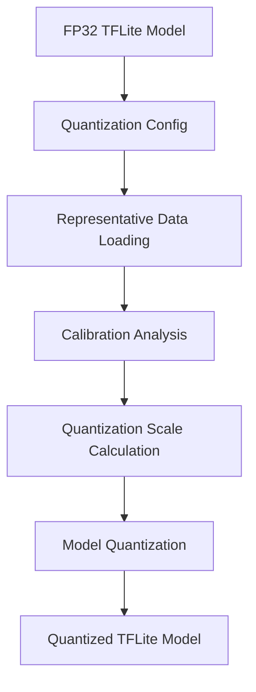

**Category:** Model Optimization Services
**Difficulty:** Intermediate
**Reading time:** 6 min read

---

TensorFlow Lite quantization reduces model precision through post-training or quantization-aware techniques, achieving 3-4x size reduction and 2-3x speedup with minimal accuracy loss. This enables deployment on memory-constrained mobile and embedded devices.

- **Post-Training Quantization** — Applies INT8 to already-trained FP32 models
- **Quantization-Aware Training** — Simulates quantization during training for better convergence
- **Dynamic Quantization** — Quantizes weights but keeps activations FP32
- **Full Integer Quantization** — INT8 weights and activations for maximum efficiency
- **Per-Channel vs Per-Tensor** — Different quantization scales for weights vs entire layer

Post-training quantization analyzes the FP32 model by running representative data and recording activation statistics. These ranges determine INT8 scaling factors. Weights are quantized using per-channel scales for better accuracy. Activations can remain FP32 (dynamic quantization) or be fully quantized. The converter embeds quantization parameters in the TFLite file as quantization metadata. During inference, the runtime dequantizes inputs, executes low-precision operations, and quantizes outputs. Quantization-aware training applies fake quantization during training, allowing the model to adapt to reduced precision.

- Quantizing mobile computer vision models
- Reducing bandwidth for edge neural network inference
- Enabling inference on microcontrollers
- Battery-efficient wearable AI applications
- Privacy-preserving on-device inference
- Latency-sensitive real-time mobile AI

| Advantage | Disadvantage |
|-----------|--------------|
| Simple post-training process, no retraining | Accuracy loss varies by model type |
| Significant size & speed improvements | Requires calibration dataset for PTQ |
| Supports hardware acceleration (GPU/NPU) | Limited to TensorFlow ecosystem |
| Works with most model architectures | Some ops don't support quantization |
| Minimal code changes for deployment | Debugging precision issues challenging |

- [TensorFlow Lite Conversion](tensorflow-lite-conversion.md)
- [Post-training Quantization PTQ](post-training-quantization-ptq.md)
- [Quantization-Aware Training QAT](quantization-aware-training-qat.md)

---
*Part of the [Model Optimization Services](index.md) category · [Back to Master Index](../../index.md)*
