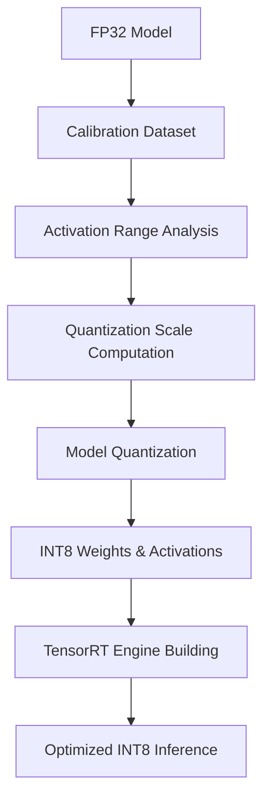

**Category:** Model Optimization Services
**Difficulty:** Intermediate
**Reading time:** 6 min read

---

TensorRT INT8 quantization reduces model precision from FP32 to 8-bit integers, dramatically decreasing memory and compute requirements with minimal accuracy loss. This enables 4x memory reduction and 2-4x throughput improvement, essential for resource-constrained deployment scenarios.

- **Calibration** — Analyzing activation ranges across representative data
- **Symmetric vs Asymmetric** — Different quantization scale and zero-point schemes
- **Per-Channel Quantization** — Different scales for different weight channels
- **Quantization-Aware Training** — Fine-tuning to adapt to INT8 precision during training
- **Accuracy Preservation** — Techniques like clipping and redistribution to minimize loss

INT8 quantization begins with calibration, feeding representative data through the FP32 model while recording activation statistics (min/max values). These ranges determine scaling factors that map FP32 values to INT8 range [-128, 127]. Symmetric schemes use single scale around zero; asymmetric schemes add zero-point offset for skewed distributions. Per-channel quantization applies different scales to different weight filters, improving accuracy. The quantized model stores INT8 weights while TensorRT fuses quantization and computation, executing entire operations in INT8. Advanced techniques like entropy calibration and KL-divergence minimize information loss during quantization.

- Mobile and edge inference on resource-constrained devices
- Data center inference cost reduction through bandwidth savings
- Real-time computer vision on edge GPUs
- Autonomous vehicle perception systems
- IoT and embedded AI applications
- Large-scale inference serving with memory constraints

| Advantage | Disadvantage |
|-----------|--------------|
| 4x model size reduction, 2-4x speedup | Requires calibration dataset and tuning |
| Minimal accuracy loss on well-tuned models | Some models degrade significantly at INT8 |
| Reduced memory bandwidth requirements | Limited operator coverage vs FP32 |
| Scales linearly to multiple GPUs | Fine-tuning may be necessary for accuracy |
| Hardware-accelerated on modern GPUs | Debugging numerical issues more difficult |

- [TensorRT Model Optimization](tensorrt-model-optimization.md)
- [Model Quantization INT8 INT4](model-quantization-int8-int4.md)
- [Post-training Quantization PTQ](post-training-quantization-ptq.md)

---
*Part of the [Model Optimization Services](index.md) category · [Back to Master Index](../../index.md)*
