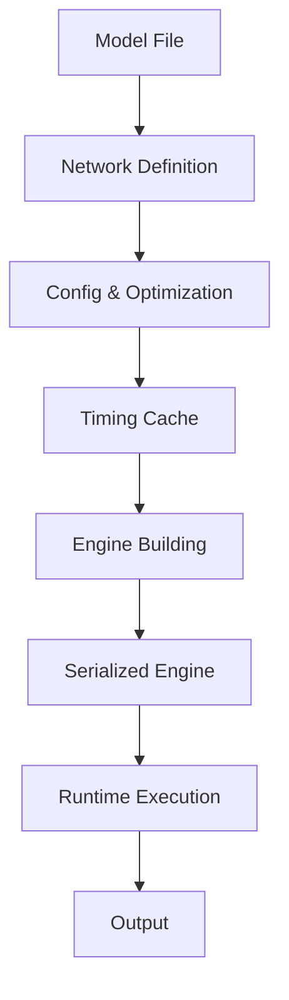

**Category:** Model Optimization Services
**Difficulty:** Intermediate
**Reading time:** 6 min read

---

TensorRT is NVIDIA's inference optimization platform that accelerates deep learning models on GPUs through graph optimization, kernel fusion, and low-precision execution. It delivers inference latency and throughput improvements of 5-40x compared to raw CUDA, making it essential for production AI applications.

- **Builder Engine** — Optimizes computation graphs for specific GPU hardware
- **Layer Fusion** — Combines multiple operations into optimized GPU kernels
- **Low-Precision Inference** — INT8 and FP16 quantization with minimal accuracy loss
- **Timing Cache** — Benchmarks kernels and selects optimal implementations
- **Batch Size Optimization** — Configures execution for different batch sizes

TensorRT's builder reads models from frameworks (ONNX, UFF, Caffe) and constructs an optimized execution graph. It analyzes each layer and searches for kernel fusion opportunities—combining conv+relu+pooling into a single optimized kernel. The timing cache benchmarks thousands of kernel implementations on the target GPU, selecting the fastest for each operation. Low-precision quantization reduces computation and memory bandwidth requirements. The optimized engine is serialized as a binary plan file that's portable across GPUs of the same compute capability. At runtime, the engine executes with minimal overhead, supporting dynamic shapes and batch sizes.

- High-throughput inference serving on NVIDIA GPUs
- Real-time computer vision in autonomous vehicles
- Video analytics and object detection at scale
- Natural language processing inference optimization
- Robotics and drone perception pipelines
- Cloud inference acceleration for cost reduction

| Advantage | Disadvantage |
|-----------|--------------|
| Exceptional latency & throughput improvements | NVIDIA GPU-specific platform |
| Native support for INT8 quantization | Steeper learning curve than ONNX Runtime |
| Excellent production stability & reliability | Limited to TensorFlow, PyTorch, ONNX models |
| Mature ecosystem with plugins & extensions | Binary engines not portable between GPU types |
| Detailed profiling and timing information | Requires separate optimization pipeline |

- [TensorRT INT8 Quantization](tensorrt-int8-quantization.md)
- [ONNX Runtime Inference Optimization](onnx-runtime-inference-optimization.md)
- [Model Quantization INT8 INT4](model-quantization-int8-int4.md)

---
*Part of the [Model Optimization Services](index.md) category · [Back to Master Index](../../index.md)*
