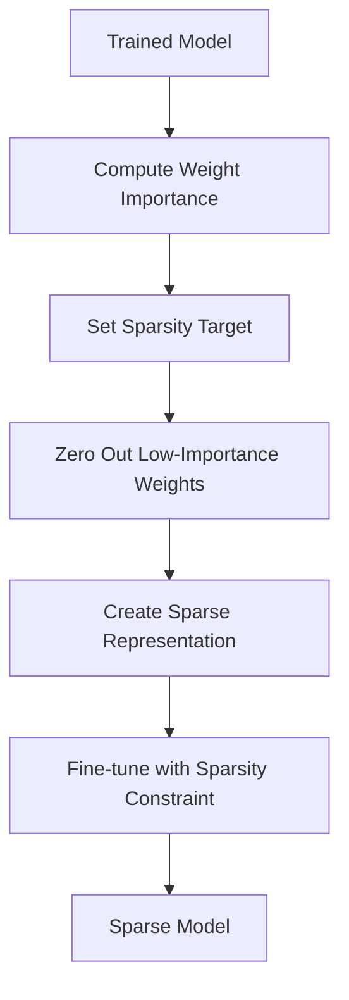

**Category:** Model Optimization Services
**Difficulty:** Intermediate
**Reading time:** 6 min read

---

Unstructured pruning removes individual weights or sparse patterns from neural networks, enabling compression ratios up to 90% or higher. Unlike structured pruning, unstructured pruning requires sparse tensor libraries for inference but offers maximum flexibility and compression potential.

- **Magnitude Pruning** — Removes weights below threshold
- **Lottery Ticket Hypothesis** — Finding sparse subnetworks that train efficiently
- **Sparse Tensors** — Data structures supporting efficient sparse computation
- **Hardware Support** — Sparse acceleration on specialized processors (Nvidia Sparse Tensor Cores)
- **Activation Sparsity** — Pruning based on activation patterns, not just weights

Unstructured pruning analyzes individual weight magnitudes, computing importance scores. Weights below a threshold are zeroed out, creating sparse matrices with non-zero elements scattered throughout. The sparse model is represented using efficient formats (COO, CSR) that store only non-zero values and their indices. Fine-tuning with sparsity constraints retrains the model while preventing pruned weights from recovering. Modern sparse tensor hardware (Nvidia's Sparse Tensor Cores) can accelerate certain operations on sparse matrices. The lottery ticket hypothesis suggests finding minimally sufficient subnetworks that could have trained successfully from scratch.

- Extreme model compression (90%+ parameter reduction)
- Combined with quantization for maximum compression
- Research into neural network sparsity patterns
- Storage-constrained deployment scenarios
- Training efficiency improvement via sparse subnetworks
- Edge devices with sparse tensor acceleration

| Advantage | Disadvantage |
|-----------|--------------|
| Extreme compression ratios (>90% possible) | Requires sparse tensor libraries |
| Maximum flexibility in pruning patterns | Limited hardware acceleration support |
| Works with any layer type | Inference still slower without sparse hardware |
| Fine-grained control over sparsity | Debugging sparse models challenging |
| Combines well with quantization | Sparse format conversion overhead |

- [Structured Pruning](structured-pruning.md)
- [Model Pruning Techniques](model-pruning-techniques.md)
- [Knowledge Distillation](knowledge-distillation.md)

---
*Part of the [Model Optimization Services](index.md) category · [Back to Master Index](../../index.md)*
