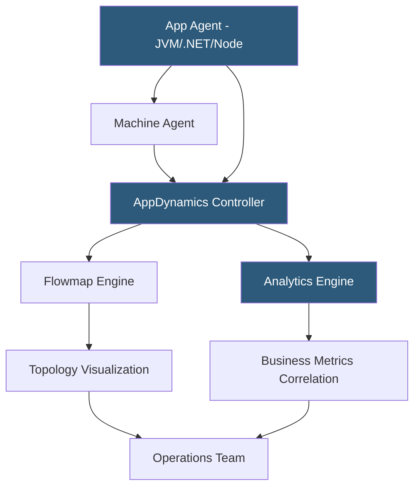

**Category:** Monitoring & Observability SaaS
**Difficulty:** Advanced
**Reading time:** 7 min read

---

AppDynamics is an enterprise APM platform acquired by Cisco that provides deep application performance monitoring, business transaction tracking, and infrastructure correlation for large-scale distributed applications. It combines byte-code instrumentation agents with a topology discovery engine to automatically map application dependencies and correlate performance degradations with business KPIs.

- **Business transaction** — an end-to-end user request tracked across all participating tiers
- **App agent** — byte-code instrumentation agent running in-process within JVM, .NET CLR, or Node
- **Machine agent** — host-level metrics agent for infrastructure data collection
- **Tier** — a logical grouping of application nodes (e.g., "Payment API" tier)
- **Flowmap** — auto-generated topology diagram showing service dependencies and health
- **Baseline deviation** — anomaly detection comparing current performance to learned baselines
- **iQ Analytics Engine** — AppDynamics' analytics pipeline for business and performance correlation

AppDynamics agents use byte-code instrumentation to intercept method invocations at the JVM, .NET CLR, or Node.js level without requiring code changes. The app agent automatically discovers frameworks (Spring, Hibernate, WCF, Express) and instruments entry points such as HTTP servlets, message queue consumers, and scheduled jobs as business transactions.

Each business transaction is tracked end-to-end across all application tiers. When a request flows from a web tier to a service tier to a database, the agent propagates correlation headers to stitch all spans into a single transaction record. The Controller — AppDynamics' central management server — aggregates these transactions and builds a dynamic flowmap showing which tiers communicate, average latency, calls per minute, and error rates for every service edge.

AppDynamics establishes dynamic baselines by learning the normal performance envelope for each business transaction over rolling time windows. Anomaly detection fires when current metrics deviate beyond configured standard deviations from baseline, reducing alert fatigue from fixed threshold rules.

The Analytics Engine correlates application performance data with business data injected via ADQL (AppDynamics Query Language) or REST API. This enables dashboards showing "revenue per minute" plotted against API response times, making it possible to quantify the business impact of a performance degradation in real time. Integration with Cisco's Intersight extends infrastructure correlation to network and compute layers.

- Monitoring enterprise Java/.NET applications with hundreds of interdependent services
- Correlating application slowdowns with specific database queries or third-party API calls
- Building business observability dashboards that tie technical metrics to revenue
- Performing capacity planning using transaction load and tier utilization trends
- Integrating with ITSM platforms (ServiceNow) for automated incident ticket creation

| Advantage | Disadvantage |
|-----------|--------------|
| Deep auto-instrumentation with no code changes | Complex licensing and high cost for enterprise deployments |
| Business transaction tracking links performance to revenue | Controller requires dedicated infrastructure to run |
| Dynamic baseline learning reduces manual threshold management | Steep learning curve for full feature utilization |
| Strong support for legacy Java/.NET enterprise stacks | Agent overhead higher than lightweight OpenTelemetry approaches |

- [Dynatrace AI Observability](dynatrace-ai-observability.md)
- [New Relic APM](new-relic-apm.md)
- [Datadog APM (Application Performance)](datadog-apm-application-performance.md)

---
*Part of the [Monitoring & Observability SaaS](index.md) category · [Back to Master Index](../../index.md)*
