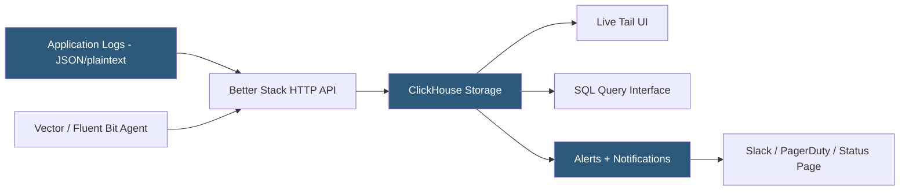

**Category:** Monitoring & Observability SaaS
**Difficulty:** Beginner
**Reading time:** 5 min read

---

Better Stack (formerly Logtail) is a modern log management and uptime monitoring platform combining structured log ingestion, SQL-based querying, and status page publishing in a single product. It uses ClickHouse as the storage backend to deliver sub-second query performance over billions of log events, and differentiates itself with a clean developer-focused UI and transparent column-store pricing.

- **ClickHouse backend** — columnar database powering sub-second aggregation queries over log data
- **Source** — a configured log origin (application, server, platform) mapped to an ingestion token
- **Live tail** — real-time streaming log view in the browser
- **SQL queries** — full SQL dialect for ad-hoc log analytics beyond keyword search
- **Status page** — publicly hosted incident and uptime page linked to Better Stack monitors
- **Heartbeat monitor** — scheduled ping check that alerts when an expected request stops arriving
- **Structured logging** — JSON log format that Better Stack parses into typed columns for SQL queries

Better Stack ingests logs via HTTP API endpoints using source-specific tokens. Libraries for Node.js, Ruby, Python, and Go wrap the HTTP API with structured logging adapters that serialize log entries as JSON before transmission. For infrastructure-level log collection, Vector and Fluent Bit are the recommended agents, both supporting Better Stack as a native sink. Kubernetes deployments typically use a DaemonSet running Vector with Better Stack output configured via Helm chart.

All ingested JSON log lines are stored in ClickHouse, a column-oriented OLAP database designed for analytics workloads. Field types are inferred from the first events in a source, creating typed columns that enable aggregation queries like `SELECT level, count(*) FROM logs WHERE timestamp > now() - interval 1 hour GROUP BY level` to return in milliseconds over hundreds of millions of rows.

The browser UI provides a live tail view, a full-text search interface, and an advanced SQL editor for power users. Unlike traditional log platforms that use proprietary query dialects, Better Stack exposes standard SQL, allowing analysts familiar with database tools to write complex log analytics immediately.

Better Stack's Uptime product runs HTTP, TCP, and DNS checks from distributed global locations and integrates with log sources so that downtime alerts link directly to the log context from the affected time window. Status pages are updated automatically from monitor results, enabling SaaS companies to maintain public incident transparency without separate tooling.

- Aggregating structured JSON application logs from a Node.js or Python service
- Running SQL aggregations over log data for business analytics (error rates by tenant)
- Publishing a customer-facing status page linked to uptime monitors
- Correlating deployment events with log error spikes using time-range SQL queries
- Replacing costly log management platforms with a ClickHouse-backed alternative

| Advantage | Disadvantage |
|-----------|--------------|
| ClickHouse enables sub-second SQL on billions of log lines | SQL query model requires more expertise for non-developers |
| Transparent pricing with column-store efficiency | Newer platform with smaller ecosystem than Datadog or Elastic |
| Unified logging and uptime monitoring in one product | Limited APM and distributed tracing features |
| Clean developer UX with fast onboarding | Alert routing options less extensive than enterprise tools |

- [Papertrail Log Aggregation](papertrail-log-aggregation.md)
- [Mezmo (LogDNA) Log Management](mezmo-logdna-log-management.md)
- [Grafana Loki for Logs](grafana-loki-for-logs.md)

---
*Part of the [Monitoring & Observability SaaS](index.md) category · [Back to Master Index](../../index.md)*
