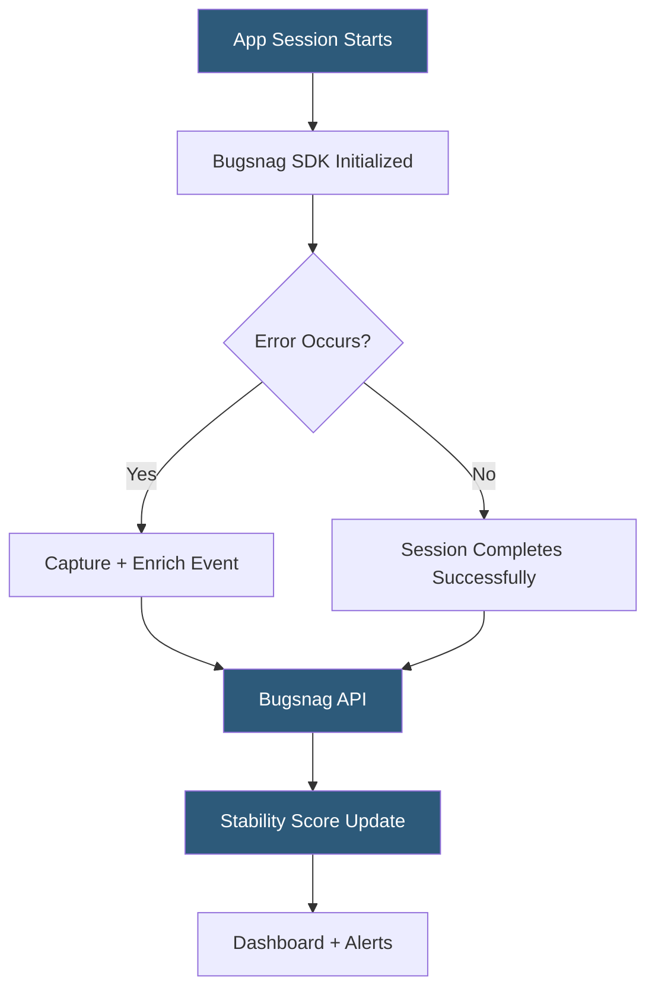

**Category:** Monitoring & Observability SaaS
**Difficulty:** Beginner
**Reading time:** 5 min read

---

Bugsnag is an application stability monitoring platform focused on error detection and session-level stability scoring. It captures crashes and exceptions across web, mobile (iOS, Android, React Native, Flutter), and server-side applications, presenting stability metrics as a percentage of error-free sessions to help teams prioritize which bugs cause the most user impact.

- **Stability score** — percentage of sessions that completed without an error
- **Error-free sessions** — Bugsnag's primary metric for measuring application health
- **Handled errors** — explicitly caught and reported exceptions (as opposed to crashes)
- **Breadcrumbs** — log of events preceding an error (navigation, user actions, console messages)
- **Error grouping** — clustering similar exceptions based on stack frame signatures
- **Release stages** — separating production, staging, and development error streams
- **Pivots** — filtering error data by app version, OS, device, user, or custom attributes

Bugsnag SDKs instrument applications by registering global exception handlers and unhandled promise rejection listeners. For mobile platforms, native crash reporters capture signal-level crashes (SIGSEGV, SIGABRT) and symbolicate them using uploaded dSYM files (iOS) or ProGuard mappings (Android). For JavaScript, source map uploads enable human-readable stack traces from minified production bundles.

Each error event carries a breadcrumb trail recorded over the session lifetime: navigation events, user interactions, log statements, and network request outcomes. This timeline makes it possible to understand the sequence of events that led to a crash without access to server-side logs.

Bugsnag's defining metric is the stability score — the percentage of sessions that completed without an unhandled error. This framing shifts the focus from raw error counts to user impact: a low-frequency error that crashes 5% of sessions is more critical than a high-frequency handled exception logged in 0.1% of sessions. Teams configure stability score thresholds as deployment gates in CI/CD pipelines.

Error grouping uses normalized stack frame matching to cluster related crashes into a single issue. Custom grouping rules allow overriding defaults for third-party library frames. Pivot analysis lets teams break down any error by app version, device model, OS version, and custom metadata to identify if a regression affects a specific configuration.

- Measuring mobile app crash-free session rates for each release
- Blocking deployments when stability score drops below a threshold
- Identifying device-specific crashes in iOS or Android apps
- Monitoring handled exceptions in payment or checkout flows
- Comparing stability across app versions after hotfixes

| Advantage | Disadvantage |
|-----------|--------------|
| Stability score provides user-impact framing | Limited APM and tracing features |
| Strong mobile SDK support (iOS, Android, Flutter) | More expensive per-seat than some alternatives |
| Session-based metrics for deployment gating | No built-in log management |
| Custom grouping rules for noisy third-party errors | Dashboard customization less flexible than Grafana |

- [Rollbar Error Monitoring](rollbar-error-monitoring.md)
- [Sentry Error Tracking](sentry-error-tracking.md)
- [Datadog Real User Monitoring](datadog-real-user-monitoring.md)

---
*Part of the [Monitoring & Observability SaaS](index.md) category · [Back to Master Index](../../index.md)*
