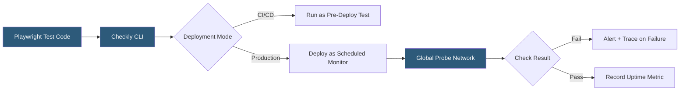

**Category:** Monitoring & Observability SaaS
**Difficulty:** Intermediate
**Reading time:** 6 min read

---

Checkly is a developer-centric synthetic monitoring platform that uses Playwright for browser-based E2E checks and custom JavaScript for API checks, enabling engineers to write monitoring as code. It integrates directly into CI/CD pipelines so the same Playwright tests that run in development also run as production monitors on a global probe schedule, unifying testing and monitoring into a single workflow.

- **Browser check** — Playwright-based E2E test executed from global probe locations on a schedule
- **API check** — HTTP request check with assertions on status, body, headers, and response time
- **Monitoring as Code (MaC)** — defining monitors in code (TypeScript/JavaScript) managed in version control
- **Check group** — a set of related checks sharing alert settings, environment variables, and retry logic
- **Runtimes** — Node.js environments available for checks, specifying available Playwright versions
- **Alert channels** — Slack, PagerDuty, Opsgenie, webhook, or email destinations for failed checks
- **Trace on failure** — automatic Playwright trace file capture when a browser check fails

Checkly's core innovation is treating monitoring as code. Engineers define browser checks as Playwright scripts and API checks as JavaScript files alongside application source code. The Checkly CLI (`checkly`) reads these check definitions and can either run them immediately (for CI/CD validation) or deploy them as production monitors configured to execute on a global schedule.

Browser checks execute full Playwright automation — navigating pages, filling forms, clicking elements, and asserting on DOM state — from probe locations across North America, Europe, and Asia Pacific. When a check fails, Checkly captures a Playwright trace file (a compressed HAR with timeline, screenshots, and console output) that engineers can open in Playwright Trace Viewer to replay the failure step-by-step. This makes debugging intermittent browser failures significantly faster than analyzing static screenshots.

API checks send HTTP requests with configurable headers, authentication, and request bodies, then evaluate the response against JSON path assertions, status code matchers, and custom JavaScript assertion functions. Response time thresholds generate separate alerts when performance degrades without a hard failure.

Check groups allow configuration inheritance: all checks in a group share environment variables (production URLs, API keys stored as secrets), alert channels, and retry settings. Retries are configurable — a check that fails once can automatically re-execute before alerting to eliminate noise from transient glitches.

Checkly's CI/CD integration runs check suites as deployment gates using GitHub Actions, GitLab CI, or any system supporting the Checkly CLI, preventing regressions from reaching production.

- Running Playwright E2E tests as production monitors on a 5-minute schedule
- Blocking deployments when API checks fail in staging environments
- Validating OAuth login flows and payment checkout pages from global locations
- Monitoring third-party API dependencies with assertion-based API checks
- Maintaining a single Playwright test codebase used for both dev testing and production monitoring

| Advantage | Disadvantage |
|-----------|--------------|
| Playwright trace on failure makes debugging fast | Requires Playwright/JavaScript knowledge — not no-code |
| Monitoring as code integrates with version control | Higher cost than simple uptime tools for complex check suites |
| Same tests run in CI and production — no duplication | Browser check execution time limited per run |
| Secrets management for API keys across environments | Probe network smaller than Pingdom's 100+ locations |

- [Pingdom Website Monitoring](pingdom-website-monitoring.md)
- [Datadog Synthetic Monitoring](datadog-synthetic-monitoring.md)
- [UptimeRobot Monitoring Service](uptimerobot-monitoring-service.md)

---
*Part of the [Monitoring & Observability SaaS](index.md) category · [Back to Master Index](../../index.md)*
