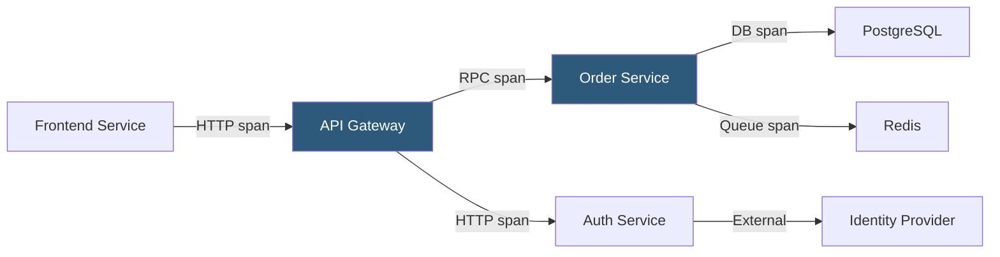

**Category:** Monitoring & Observability SaaS
**Difficulty:** Intermediate
**Reading time:** 6 min read

---

Datadog APM provides distributed tracing and code-level performance visibility for modern applications by automatically instrumenting service calls, database queries, and external HTTP requests. It correlates traces with infrastructure metrics and logs to enable rapid root cause analysis across microservice architectures.

- **Distributed Trace** — End-to-end record of a request as it propagates through multiple services, represented as a directed acyclic graph of spans
- **Span** — Single unit of work within a trace capturing service name, resource, duration, status code, and metadata tags
- **Service Map** — Auto-generated topology diagram showing service dependencies, call rates, error rates, and latency percentiles
- **Flame Graph** — Hierarchical visualization of span durations helping identify the slowest code paths within a trace
- **Trace Sampling** — Strategy controlling which fraction of traces are retained for storage; head-based and tail-based samplers available
- **Continuous Profiler** — Always-on CPU and memory profiler correlating code hotspots directly to trace spans
- **Watchdog** — ML algorithm that autonomously detects anomalous latency, error rate, or throughput shifts and surfaces alerts without manual monitor configuration
- **APM Instrumentation** — Auto-instrumentation libraries for Python, Java, Go, Ruby, Node.js, and .NET injected via the Datadog tracer SDK

Datadog APM injects a tracer library into each service process at startup. When a request enters, the tracer creates a root span and propagates a trace context header (W3C TraceContext or Datadog's B3 format) to every downstream call. Each participating service creates child spans that record execution time, SQL queries, Redis commands, and outbound HTTP calls. Spans are batched and forwarded to the local Datadog Agent, which applies head-based sampling rules before forwarding to the backend.

Tail-based sampling, called Tracing Without Limits, buffers all spans in the Agent for a configurable window and retains complete traces that contain errors or high latency even if they would have been dropped by head sampling. This ensures error traces are always available for debugging.

The backend stitches spans by trace ID into a complete trace tree, calculates service-level RED metrics (Rate, Errors, Duration) in real time, and publishes them to the Service Catalog. The Service Map visualizes these metrics as edge labels on a live dependency graph, allowing engineers to quickly isolate which service introduced a latency regression.

Continuous Profiler runs a statistical sampling profiler in the same process and maps hot stack frames to the spans executing at that time, enabling precise identification of slow database serialization or inefficient loops without requiring manual profiling sessions.

- Tracing a slow checkout request across frontend, API, inventory, and payment services to find the bottleneck
- Detecting a sudden increase in database query latency after a schema migration
- Correlating a downstream service error rate spike with a recent code deployment via deployment markers
- Identifying N+1 query patterns from ORM-generated SQL captured in span metadata
- Using Watchdog to receive automated anomaly alerts without writing explicit monitors

| Advantage | Disadvantage |
|-----------|--------------|
| Auto-instrumentation covers most frameworks with zero code changes | High-cardinality span tags can inflate custom metric quotas and increase costs |
| Unified UI correlates traces, logs, and metrics in a single click | Tail-based sampling requires sufficient Agent memory; noisy services may need tuning |
| Service Map auto-generates from trace data with no manual topology configuration | Java and .NET auto-instrumentation uses bytecode manipulation which can conflict with security agents |
| Continuous Profiler links CPU hotspots directly to individual traces | Profiler overhead (~2–3% CPU) requires validation in performance-sensitive workloads |

- [Datadog Infrastructure Monitoring](datadog-infrastructure-monitoring.md)
- [Datadog Log Management](datadog-log-management.md)
- [Datadog Real User Monitoring](datadog-real-user-monitoring.md)

---
*Part of the [Monitoring & Observability SaaS](index.md) category · [Back to Master Index](../../index.md)*
