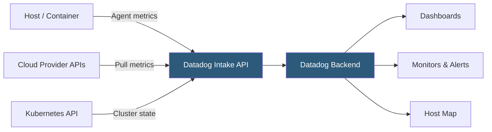

**Category:** Monitoring & Observability SaaS
**Difficulty:** Intermediate
**Reading time:** 6 min read

---

Datadog Infrastructure Monitoring provides unified visibility into hosts, containers, and cloud resources through a SaaS-delivered agent-based collection pipeline. It aggregates metrics, tags, and topology data to deliver real-time dashboards, anomaly detection, and alerting across hybrid and multi-cloud environments.

- **Datadog Agent** — Lightweight daemon installed on hosts that collects system and application metrics, then ships them to Datadog's intake endpoints
- **Integration** — Pre-built connectors for AWS, GCP, Azure, Kubernetes, databases, and 700+ technologies that enrich host data with service-level metrics
- **Tag** — Key-value pair applied to hosts or metrics enabling slicing dashboards and alerts by environment, team, or service
- **Monitor** — Rule-based or anomaly-based alert definition that triggers notifications via PagerDuty, Slack, or webhooks
- **Dashboard** — Customizable visualization canvas combining timeseries, heatmaps, and service maps
- **Host Map** — Topology view grouping hosts by tag to surface utilization patterns at scale
- **NPM (Network Performance Monitoring)** — eBPF-based module capturing packet-level flows between services without code changes
- **Live Containers** — Real-time view of container state, resource consumption, and pod health across orchestration platforms

The Datadog Agent runs as a system service on each host and periodically samples OS-level metrics—CPU, memory, disk I/O, and network throughput—at a default 15-second interval. The agent also autodiscovers running processes and containers, applying additional checks based on detected workloads. Metrics are batched and forwarded over HTTPS to Datadog's regional intake endpoints, where they are ingested into a time-series store.

Cloud integrations supplement agent data by polling provider APIs (CloudWatch, Azure Monitor, Stackdriver) at one-minute intervals, pulling managed service metrics that cannot have an agent installed. Kubernetes integration uses the kube-state-metrics sidecar and the Datadog Cluster Agent to collect pod status, resource requests, and limits at cluster scope.

All ingested data is enriched with host-level tags derived from cloud metadata (region, instance type, auto-scaling group) and user-defined tags applied via the agent configuration or infrastructure API. This tag taxonomy underpins every downstream feature—monitors filter by tag to scope alerts, dashboards use tag variables for dynamic filtering, and the Host Map renders tag-based groupings as color-coded cells.

Monitors evaluate metric streams against configurable thresholds or statistical baselines. Anomaly detection monitors train short-term seasonal models and alert when observations deviate beyond expected bounds, reducing alert fatigue without manual threshold tuning.

- Correlating CPU spikes on EC2 instances with corresponding latency increases in downstream services
- Tracking container resource utilization to right-size Kubernetes resource requests and limits
- Building executive dashboards that aggregate SLO compliance across multiple services and teams
- Detecting silent infrastructure failures (disk fill, zombie processes) before they cause outages
- Enforcing cost governance by tagging hosts by team and generating chargeback reports

| Advantage | Disadvantage |
|-----------|--------------|
| Unified agent collects infrastructure, APM, logs, and security from a single binary | Per-host pricing escalates rapidly for large fleets; container-heavy environments need careful SKU management |
| 700+ out-of-the-box integrations reduce custom instrumentation effort | Full-fidelity custom metrics incur additional cost beyond the default allowance |
| Tag-based data model enables flexible ad-hoc slicing without schema changes | Agent version updates can occasionally break integrations; requires fleet-wide rollout coordination |
| Anomaly and forecast monitors reduce manual threshold maintenance | Machine-learning monitors require historical data before producing reliable baselines |

- [Datadog APM (Application Performance)](datadog-apm-application-performance.md)
- [Datadog Log Management](datadog-log-management.md)
- [Datadog Real User Monitoring](datadog-real-user-monitoring.md)

---
*Part of the [Monitoring & Observability SaaS](index.md) category · [Back to Master Index](../../index.md)*
