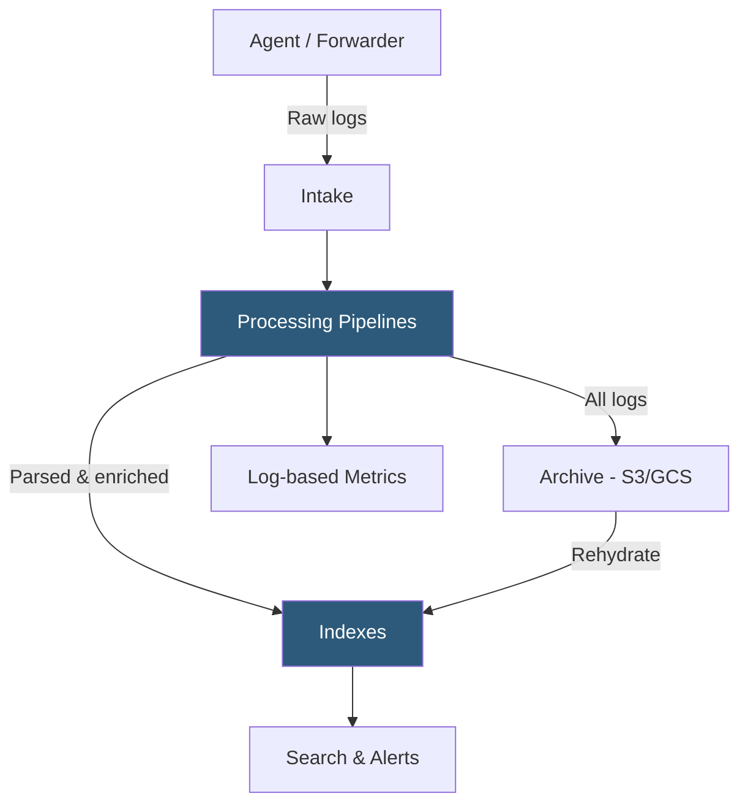

**Category:** Monitoring & Observability SaaS
**Difficulty:** Intermediate
**Reading time:** 6 min read

---

Datadog Log Management ingests, indexes, and archives structured and unstructured logs from any source, providing real-time search, pattern analysis, and alert correlation alongside metrics and traces. Its flexible pipeline architecture transforms raw log data into structured fields for efficient querying and cost-controlled retention.

- **Log Pipeline** — Ordered set of processors that parse, remap, enrich, and filter log records before indexing
- **Grok Parser** — Pattern-matching processor using named capture groups to extract structured fields from unstructured log strings
- **Log Index** — Partitioned storage bucket with configurable retention period and daily volume cap that controls cost
- **Exclusion Filter** — Rules applied at index ingestion to drop noisy or low-value logs before they consume index quota
- **Log Archive** — Long-term cold storage of all ingested logs to S3, GCS, or Azure Blob, rehydratable for retroactive analysis
- **Log-based Metric** — Counter or distribution metric generated from log attributes without storing the raw log, enabling cost-efficient KPI tracking
- **Live Tail** — Real-time streaming view of incoming log lines for immediate debugging without search latency
- **Sensitive Data Scanner** — Automated PII detection and redaction engine applied to logs before storage

Logs reach Datadog through several collection paths: the Agent tail-follows local files and container stdout/stderr; integrations forward application-specific logs; and direct HTTPS or TCP endpoints accept logs from serverless functions, third-party SaaS tools, and custom shippers. Once received at the intake layer, logs enter the pipeline processor chain.

Pipelines are evaluated in priority order. Each pipeline's filter expression determines which logs pass through its processor set. Inside a pipeline, processors execute sequentially: a Grok parser extracts structured fields from a raw message, attribute remappers normalize field names across heterogeneous sources, and enrichment processors add geo-location from IP addresses or look up service ownership from a reference table. Status remappers translate application-specific severity strings (WARN, CRITICAL) into Datadog's canonical log levels for consistent filtering.

After processing, logs are routed to matching indexes based on tag and attribute filter rules. Exclusion filters within each index drop sampled fractions of verbose log classes, allowing teams to retain 100% of error logs while sampling 1% of debug noise—dramatically reducing cost while preserving signal. Every ingested log is also written to the configured archive bucket regardless of index exclusions, providing a complete audit trail for compliance.

Log-based metrics convert high-cardinality log attributes (HTTP status codes, user IDs) into time-series metrics stored for 15 months, decoupling retention cost from query performance for business KPIs.

- Parsing Nginx access logs to extract latency, status code, and URL path for dashboard visualization
- Creating exclusion filters that drop 99% of health check logs to stay within index budget
- Correlating a trace span ID embedded in application logs to jump directly from a slow trace to its corresponding log context
- Configuring the Sensitive Data Scanner to automatically mask credit card numbers in payment service logs
- Rehydrating a 90-day-old archive to investigate a compliance incident without paying for long-term index retention

| Advantage | Disadvantage |
|-----------|--------------|
| Seamless correlation between logs, traces, and metrics in a single UI | Log indexing costs grow linearly with volume; exclusion filter tuning requires ongoing maintenance |
| Grok and JSON parsers handle most log formats without custom code | Pipeline debugging is complex; malformed patterns silently leave fields un-parsed |
| Archives enable unlimited retention with pay-per-rehydration pricing | Rehydration jobs take minutes to hours; not suitable for live incident debugging from cold data |
| Log-based metrics decouple KPI storage cost from raw log indexing cost | Log-based metric cardinality limits apply; high-cardinality dimensions require careful design |

- [Datadog Infrastructure Monitoring](datadog-infrastructure-monitoring.md)
- [Datadog APM (Application Performance)](datadog-apm-application-performance.md)
- [Datadog Synthetic Monitoring](datadog-synthetic-monitoring.md)

---
*Part of the [Monitoring & Observability SaaS](index.md) category · [Back to Master Index](../../index.md)*
