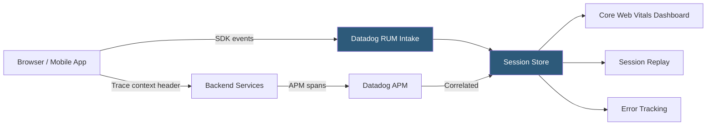

**Category:** Monitoring & Observability SaaS
**Difficulty:** Intermediate
**Reading time:** 6 min read

---

Datadog Real User Monitoring (RUM) captures every user interaction, page load, and resource request in browser and mobile applications, providing performance visibility from the end-user perspective. By correlating frontend events with backend traces, it delivers a complete picture of how application performance impacts actual user experience.

- **Session** — Sequence of user actions and views within a single browser or app session, capped at 4 hours of activity
- **View** — Single page or screen load, capturing Core Web Vitals, resource timings, and long tasks
- **Core Web Vitals** — Google's LCP (Largest Contentful Paint), FID (First Input Delay), and CLS (Cumulative Layout Shift) metrics captured per view
- **Resource Timing** — Granular breakdown of DNS lookup, TCP connect, SSL handshake, TTFB, and content download for each asset
- **Action** — User interaction (click, scroll, custom event) linked to subsequent network requests and view changes
- **Session Replay** — Pixel-level recording of DOM mutations allowing developers to watch exactly what a user experienced
- **RUM Browser SDK** — JavaScript snippet loaded on pages that instruments the browser's Navigation Timing, Resource Timing, and PerformanceObserver APIs
- **Frontend-to-Backend Correlation** — Automatic injection of trace IDs into XHR/Fetch calls linking RUM sessions to APM backend traces

The RUM Browser SDK is loaded as a small JavaScript snippet in the page's `<head>`. On page load, it captures the browser's Navigation Timing API data to record TTFB, DOM interactive, and load event timings. It patches `XMLHttpRequest` and the `fetch` API to record resource timings for every network call and injects Datadog trace context headers so backend APM spans can be correlated with the originating user session.

The PerformanceObserver API feeds LCP, FID, and CLS measurements as they are emitted by the browser. Long animation frames (LoAF) and layout shift entries are captured with source attribution identifying which DOM elements caused shifts. JavaScript errors caught by a global error handler are enriched with stack traces and linked to the current session and view.

Session Replay records DOM mutation events using MutationObserver, serializing incremental snapshots rather than full page captures. This approach achieves high fidelity replay at minimal bandwidth cost. Privacy controls automatically mask input fields and redact text nodes matching configurable CSS selectors or predefined PII patterns before data leaves the browser.

All events are batched and flushed to the RUM intake on page unload or at 60-second intervals. On the backend, sessions are assembled from view and action events, enabling funnel analysis, session segment filtering by geography or device, and error-to-session attribution.

- Identifying that 95th percentile LCP exceeds 4 seconds for mobile users in Southeast Asia due to large hero images
- Replaying a customer support escalation to understand exactly what a user saw when a checkout form error occurred
- Correlating a slow backend database query (visible in APM) to a specific user session experiencing a cart timeout
- Building funnels to measure drop-off between product page view and purchase completion
- Detecting a JavaScript exception introduced by a third-party ad script degrading Core Web Vitals scores

| Advantage | Disadvantage |
|-----------|--------------|
| Frontend-to-backend trace correlation eliminates context switching between tools | Session Replay data volume increases storage costs; sampling strategies required for high-traffic sites |
| Automatic Core Web Vitals capture aligns with Google's page experience signals | Single-page applications require manual view tracking for URL changes that don't trigger page reloads |
| Privacy masking is configurable without changing application code | SDK adds ~30KB to page payload; must be loaded asynchronously to avoid blocking render |
| Mobile SDKs (iOS, Android, React Native) provide parity with browser instrumentation | High-cardinality attributes in custom actions increase index cost without careful tagging discipline |

- [Datadog APM (Application Performance)](datadog-apm-application-performance.md)
- [Datadog Synthetic Monitoring](datadog-synthetic-monitoring.md)
- [Datadog Log Management](datadog-log-management.md)

---
*Part of the [Monitoring & Observability SaaS](index.md) category · [Back to Master Index](../../index.md)*
