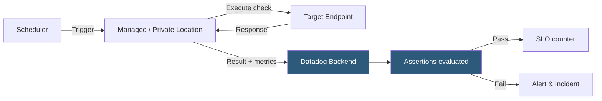

**Category:** Monitoring & Observability SaaS
**Difficulty:** Intermediate
**Reading time:** 5 min read

---

Datadog Synthetic Monitoring proactively tests application availability, performance, and correctness from managed and private locations worldwide, simulating user journeys before real users encounter failures. It combines API tests, browser tests, and multistep checks to validate critical paths continuously and alert teams to regressions.

- **API Test** — HTTP, TCP, DNS, SSL, or gRPC check that validates endpoint availability, response time, and payload correctness
- **Browser Test** — Headless Chromium automation that records and replays a user interaction sequence, capturing screenshots and performance metrics at each step
- **Multistep API Test** — Chain of sequential API calls that reuse extracted variables (tokens, IDs) across steps to simulate authenticated workflows
- **Private Location** — Self-hosted synthetic agent running inside a private network to test internal endpoints unreachable from public PoPs
- **Managed Location** — Datadog-operated Points of Presence in 30+ regions used for external endpoint testing
- **Assertion** — Expected condition checked after each test step (status code, body content, response time threshold, certificate expiry)
- **CI/CD Integration** — Synthetic tests triggered in deployment pipelines to block releases when critical paths regress
- **SLO Integration** — Synthetic test results feed directly into Datadog SLO tracking to calculate uptime error budgets

Synthetic tests are configured with a check interval (as low as 60 seconds), a set of execution locations, and assertions. For API tests, Datadog's managed runners make real HTTP requests to the configured URL, measuring DNS resolution, TCP connection, SSL handshake, and time-to-first-byte independently. Response bodies are parsed as JSON, XML, or plain text and validated against assertion rules using regex or exact match operators.

Browser tests use a no-code recorder extension that captures click, type, and navigation actions as a replayable script. At execution time, a headless Chromium instance runs the script, and each step captures a screenshot, the page's performance timeline, and any JavaScript errors. Variables extracted from previous steps (e.g., a session token from a login response) are injected into subsequent actions, enabling full authenticated workflow coverage.

Private Locations are Docker containers deployed inside a customer's VPN or on-premises network. They pull test configurations from Datadog over an outbound connection (no inbound firewall rules required) and post results back to the intake. This model allows testing of staging environments, internal APIs, and databases without exposing them to the public internet.

CI/CD integration via the `datadog-ci synthetics run-tests` CLI command triggers a subset of tests against a staging URL before production deployment. Test results with configurable pass/fail thresholds can block the pipeline, providing automated synthetic gatekeeping.

- Monitoring checkout flow availability from 15 global locations to detect regional CDN failures
- Running SSL certificate expiry checks to alert 30 days before expiration
- Blocking a deployment pipeline when a synthetic login test fails in staging
- Testing an internal payment processing API from a private location inside a PCI-scoped subnet
- Feeding browser test uptime results into an SLO dashboard for customer-facing availability reporting

| Advantage | Disadvantage |
|-----------|--------------|
| Detects issues before real users are impacted; complements RUM reactive data | Browser test maintenance burden increases with UI churn; assertions break when DOM structure changes |
| Private Locations enable testing of internal and pre-production environments | Private Location infrastructure requires container orchestration and ongoing management |
| CI/CD integration provides automated release gating without custom scripting | Synthetic tests measure a single scripted path; cannot detect issues affecting specific user segments |
| Managed locations eliminate need to maintain global monitoring infrastructure | High-frequency tests from many locations can trigger rate limits on tested APIs |

- [Datadog Real User Monitoring](datadog-real-user-monitoring.md)
- [Datadog Infrastructure Monitoring](datadog-infrastructure-monitoring.md)
- [Checkly Synthetic Monitoring](checkly-synthetic-monitoring.md)

---
*Part of the [Monitoring & Observability SaaS](index.md) category · [Back to Master Index](../../index.md)*
