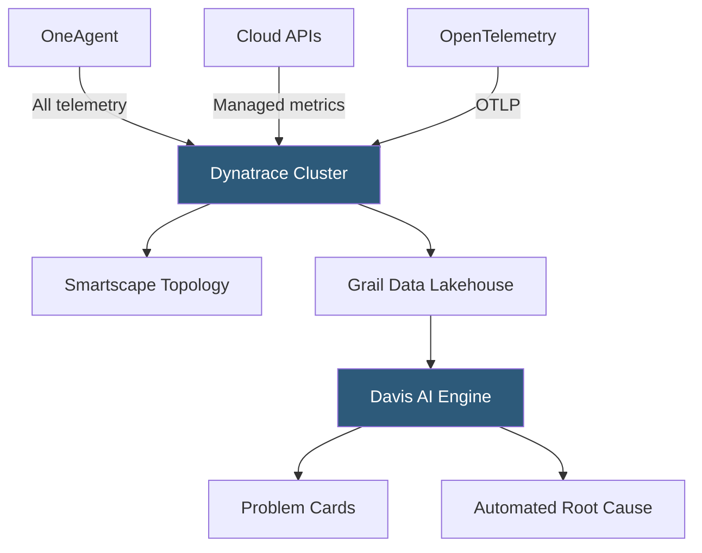

**Category:** Monitoring & Observability SaaS
**Difficulty:** Advanced
**Reading time:** 7 min read

---

Dynatrace delivers AI-powered full-stack observability through its proprietary Davis AI engine, which automatically detects anomalies, identifies root causes, and correlates infrastructure, application, and user experience telemetry without manual configuration. Its OneAgent technology instruments every process on a host with a single install, eliminating the need to configure individual integrations.

- **Davis AI** — Dynatrace's causal AI engine that continuously models service dependencies, detects anomalies, and performs automated root cause analysis
- **OneAgent** — Single deployable agent that auto-discovers and instruments all processes, containers, and services on a host
- **Smartscape** — Real-time topology map showing all entities (hosts, processes, services, applications) and their dependency relationships
- **Problem Card** — Davis-generated incident record linking root cause, affected entities, impact radius, and suggested remediation
- **PurePaths** — Dynatrace's distributed tracing implementation capturing every transaction at code level without sampling
- **DQL (Dynatrace Query Language)** — Unified query syntax for metrics, logs, traces, and events across the Grail data platform
- **Grail** — Dynatrace's next-generation data lakehouse providing unified storage and query for all observability data types
- **AutoDiscovery** — Automatic detection of new services, containers, and cloud resources with immediate instrumentation without restart

Dynatrace's OneAgent deployment model sets it apart from competitors. After installing a single agent on a host, OneAgent auto-discovers every process—JVM, Node.js runtime, .NET CLR, containerized workloads—using process group detection and injects monitoring code at the operating system level via kernel-space hooks and userspace injection. No per-technology configuration is required; new services starting on the host are automatically instrumented.

PurePaths captures distributed traces at full 100% sampling rate using an adaptive sampling scheme for storage efficiency. Rather than head-based probabilistic sampling, Dynatrace captures code-level execution data for every transaction and applies retention policies based on transaction significance. This provides accurate tail latency percentiles and complete error context that sampling-based systems miss.

Davis AI operates on the Smartscape topology model—a real-time graph of entity relationships inferred from observed network calls and dependency data. When a performance anomaly is detected (using Baselining algorithms trained on rolling 2-week windows), Davis traverses the dependency graph backward from the symptom to identify the probable root cause. Davis evaluates hundreds of hypothesis chains and assigns confidence scores, surfacing only the most probable root cause in the Problem Card rather than a list of correlated alerts.

The Grail data lakehouse unifies metrics, logs, traces, and events in a single storage tier queryable via DQL. This eliminates the data siloing that occurs when separate products handle each telemetry type, enabling queries that join trace spans with log lines and infrastructure metrics in a single statement.

- Receiving a single Problem Card summarizing a cascading failure that triggered 47 individual metric alerts in competing tools
- Auto-discovering a new microservice deployed by the platform team and immediately monitoring it without manual configuration
- Using PurePaths to capture the exact slow SQL query on the 99.9th percentile request that sampling-based APM would miss
- Querying Grail to correlate a Kubernetes pod OOM kill event with the preceding memory growth in application trace data
- Using Davis anomaly detection to receive advance warning of a growing memory leak before it crosses a manually set threshold

| Advantage | Disadvantage |
|-----------|--------------|
| OneAgent eliminates per-technology integration configuration; immediate coverage after install | Per-host pricing model is expensive for large fleets and ephemeral container environments |
| Davis AI reduces alert noise to actionable Problem Cards; fewer false positives than threshold alerts | Grail and DQL are proprietary; lock-in is deeper than OpenTelemetry-native platforms |
| 100% PurePaths capture provides accurate tail latency data missing from sampled tracing | Full PurePath storage at scale requires careful retention policy configuration to control costs |
| Smartscape topology auto-generates without manual service catalog maintenance | Davis AI root cause inference is opaque; engineers may not trust or understand suggested root causes |

- [Dynatrace Davis AI Engine](dynatrace-davis-ai-engine.md)
- [Dynatrace OneAgent](dynatrace-oneagent.md)
- [New Relic Observability Platform](new-relic-observability-platform.md)

---
*Part of the [Monitoring & Observability SaaS](index.md) category · [Back to Master Index](../../index.md)*
