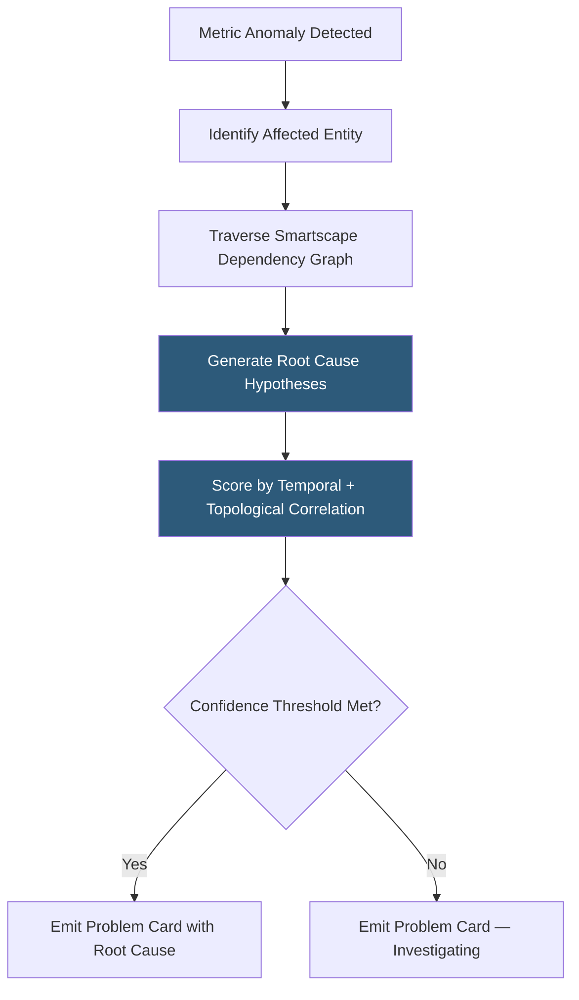

**Category:** Monitoring & Observability SaaS
**Difficulty:** Advanced
**Reading time:** 6 min read

---

Davis is Dynatrace's proprietary causal AI engine that continuously analyzes topology relationships, baseline deviations, and event correlations to perform automated root cause analysis without human-defined alert correlation rules. It reduces the mean time to identify (MTTI) incidents by surfacing a single actionable Problem Card instead of a flood of individual metric alerts.

- **Baselining** — Automated statistical modeling of normal behavior for each monitored metric using rolling historical data, accounting for time-of-day and day-of-week seasonality
- **Anomaly Detection** — Identification of metrics deviating beyond learned baseline bounds, triggered without manual threshold configuration
- **Root Cause Analysis (RCA)** — Causal graph traversal algorithm that identifies the originating entity in a cascading failure chain
- **Problem Card** — Unified incident record generated by Davis aggregating all related anomalies, affected entities, timeline, and probable root cause
- **Dependency Graph** — Smartscape topology model that Davis traverses to evaluate causal hypotheses
- **Confidence Score** — Numeric rating (0–100) Davis assigns to each root cause hypothesis based on temporal correlation and topological proximity
- **Davis Copilot** — Generative AI assistant layer built on Davis that accepts natural language queries and generates DQL queries, dashboards, and remediation suggestions
- **Predictive AI** — Forecast models projecting future metric trajectories to surface capacity exhaustion risks before they materialize

Davis operates on two continuous streams: baseline models and topology events. For every monitored metric (response time, error rate, CPU, GC pause), Davis trains a univariate time-series model on the preceding two weeks of data. The model captures diurnal and weekly seasonality, computing dynamic upper and lower bounds that tighten during low-traffic periods and widen during peak load. An anomaly fires when observations breach these adaptive bounds—not a static threshold—reducing false positives from expected traffic fluctuations.

When an anomaly fires, Davis retrieves the entity's Smartscape context: the services it depends on, the infrastructure hosting it, and any recent change events (deployments, configuration changes, cloud provider events). It generates a set of root cause hypotheses by walking backward through causal chains—for example, a response time increase on an order service might be caused by a database it depends on, which is hosted on an EC2 instance that received a CPU credit exhaustion event 90 seconds earlier.

Each hypothesis is scored by temporal ordering (the root cause must precede the symptom), topological proximity (direct dependencies rank higher than transitive ones), and co-occurrence rate (entities that degrade together historically are scored higher). The highest-scoring hypothesis is presented as the probable root cause in the Problem Card. Multiple related anomalies detected within a rolling time window are merged into a single Problem rather than generating individual alerts, dramatically reducing incident notification volume.

Davis Copilot extends this model with a generative AI layer that translates natural language questions ("Why is checkout slow today?") into DQL queries, interprets results, and suggests remediation actions based on the root cause context.

- Receiving one Problem Card when a database node failure triggers 23 downstream service anomalies simultaneously
- Using predictive AI to receive advance warning that disk utilization will exhaust in 6 hours based on current write rate
- Querying Davis Copilot in natural language to generate a DQL dashboard for a post-incident review without writing queries manually
- Comparing Davis-identified root causes to manual RCA conclusions over 30 days to calibrate trust in automated analysis
- Using change event correlation to immediately link a performance regression to the specific deployment marker that preceded it

| Advantage | Disadvantage |
|-----------|--------------|
| Automated baselining eliminates the manual threshold maintenance burden | Baseline models require 2 weeks of historical data before producing reliable anomaly detection |
| Single Problem Card reduces alert fatigue versus per-metric threshold alerting | Root cause inference is probabilistic; Davis can misidentify root cause in novel failure modes |
| Temporal and topological hypothesis scoring is more reliable than simple alert correlation | The causal reasoning process is partially opaque; engineers cannot inspect the full hypothesis graph |
| Predictive AI surfaces capacity risks days before manual alerting would fire | Predictive models are less accurate for irregular workloads without stable seasonal patterns |

- [Dynatrace AI Observability](dynatrace-ai-observability.md)
- [Dynatrace OneAgent](dynatrace-oneagent.md)
- [Honeycomb Observability](honeycomb-observability.md)

---
*Part of the [Monitoring & Observability SaaS](index.md) category · [Back to Master Index](../../index.md)*
