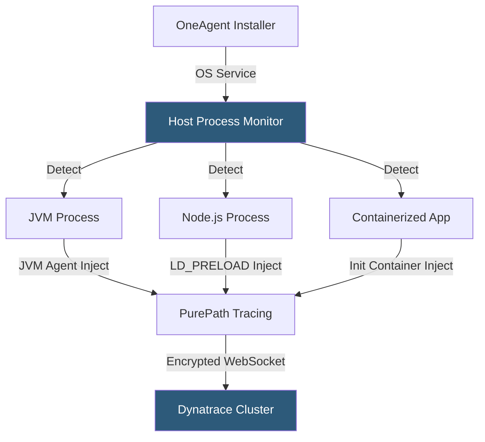

**Category:** Monitoring & Observability SaaS
**Difficulty:** Intermediate
**Reading time:** 6 min read

---

Dynatrace OneAgent is a single-installable monitoring agent that auto-discovers and instruments every process, container, and service on a host without per-technology configuration. It deploys via an OS-level installer or Kubernetes operator and handles versioning, injection, and configuration centrally from the Dynatrace management cluster.

- **Process Group** — Logical grouping of same-technology processes OneAgent detects automatically (e.g., all Java processes running the same JAR)
- **Auto-Discovery** — Continuous scanning of host processes to detect new workloads and apply instrumentation without agent restarts
- **Injection Technology** — Platform-specific code injection (JVM agent, .NET CLR profiler, LD_PRELOAD hook) used to instrument each process type
- **OneAgent Operator** — Kubernetes operator managing OneAgent daemonset deployment, upgrades, and pod injection across a cluster
- **Communication Channel** — Encrypted WebSocket connection between OneAgent and the Dynatrace cluster for data transmission and configuration updates
- **Self-Monitoring** — OneAgent reports its own health, connectivity status, and instrumentation coverage to the Dynatrace management UI
- **Full-Stack Monitoring** — Combined host metrics, process metrics, and application traces captured by a single agent without separate product installs
- **Network Zones** — Logical groupings of OneAgent deployments that route data through designated ActiveGate proxies for network segmentation

OneAgent installs as a system service via a platform-specific installer (MSI for Windows, shell script for Linux, DEB/RPM packages). After installation, the agent's host monitor process continuously scans the process table to detect running workloads. For each detected process group technology, the appropriate injection mechanism is applied: JVM processes receive a `-javaagent` flag via the OS process environment modification; .NET processes are instrumented via the CLR profiler interface; Node.js and other runtimes use `LD_PRELOAD` or equivalent to load monitoring libraries.

For containerized environments, the OneAgent Kubernetes operator deploys a DaemonSet ensuring every node has a OneAgent instance. An admission webhook injects an init container into each new pod; the init container copies the appropriate agent binaries and sets environment variables that enable instrumentation when the application container starts. This model covers pods without requiring modifications to application container images.

Configuration synchronization flows from the Dynatrace management cluster to OneAgent over an encrypted WebSocket connection. When a new instrumentation rule is published (e.g., enabling a specific framework plugin), OneAgent applies it to existing processes without restart if possible, or flags the process for next-restart instrumentation. OneAgent also handles automatic version updates: the management cluster pushes new agent versions, which are staged and applied to hosts during a configured maintenance window.

Sensitive network topologies route OneAgent communication through ActiveGate proxy components deployed in each network zone, ensuring traffic does not traverse public internet paths even when the Dynatrace management cluster is SaaS-hosted.

- Deploying monitoring across a 500-host fleet by installing OneAgent via Ansible playbook without any per-application configuration
- Using the Kubernetes operator to automatically instrument every pod in a dynamic microservice environment as new deployments roll out
- Upgrading OneAgent across the entire fleet from the Dynatrace management UI without individual host access
- Routing OneAgent traffic through an ActiveGate in a PCI-scoped network zone to comply with data residency requirements
- Using OneAgent's process group auto-discovery to immediately detect an unauthorized process introduced by a developer

| Advantage | Disadvantage |
|-----------|--------------|
| Single install covers all technologies; no per-framework configuration required | Deep OS-level hooks can conflict with security agents (EDR, RASP) requiring vendor coordination |
| Centralized version management eliminates fleet agent drift | All-or-nothing instrumentation model; cannot easily exclude specific processes from monitoring |
| Kubernetes operator automates pod injection for dynamic environments | Init container injection adds container startup overhead; can delay pod readiness in time-sensitive deployments |
| Self-monitoring reports instrumentation coverage gaps proactively | Per-host pricing makes OneAgent expensive for ephemeral short-lived container fleets |

- [Dynatrace AI Observability](dynatrace-ai-observability.md)
- [Dynatrace Davis AI Engine](dynatrace-davis-ai-engine.md)
- [Datadog Infrastructure Monitoring](datadog-infrastructure-monitoring.md)

---
*Part of the [Monitoring & Observability SaaS](index.md) category · [Back to Master Index](../../index.md)*
