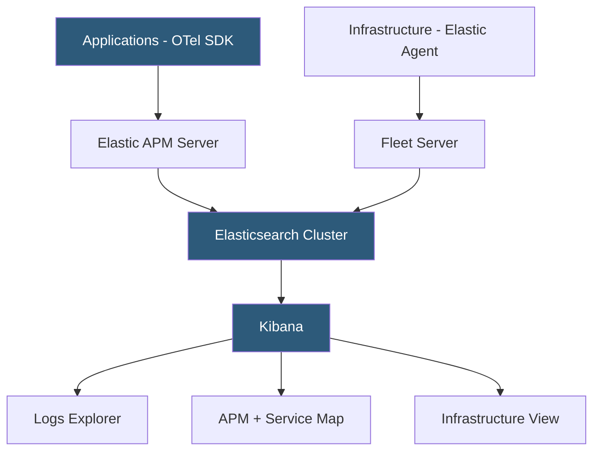

**Category:** Monitoring & Observability SaaS
**Difficulty:** Advanced
**Reading time:** 7 min read

---

Elastic Observability is a unified observability solution built on the Elastic Stack (Elasticsearch, Kibana, Beats, Logstash) that consolidates logs, metrics, traces, and synthetic monitoring into a single platform. It uses OpenTelemetry as the primary instrumentation standard and leverages Elasticsearch's inverted-index and columnar storage for high-performance search and analytics over petabytes of observability data.

- **Elastic APM** — distributed tracing and application performance monitoring using OpenTelemetry
- **Beats** — lightweight data shippers (Metricbeat, Filebeat, Packetbeat) for infrastructure telemetry
- **Fleet** — central management system for deploying and configuring Elastic Agents
- **Data streams** — time-series optimized Elasticsearch index strategy for observability data
- **Service Map** — auto-generated topology diagram from distributed trace data
- **SLO management** — built-in service level objective tracking in Kibana
- **Alerting** — rule-based and ML-driven alert detection with multi-channel routing

Elastic Observability ingests data through three primary paths. For application traces and metrics, the Elastic APM Server accepts OpenTelemetry Protocol (OTLP) payloads as well as Elastic's native agent protocol, enabling any OpenTelemetry-instrumented application to send data without vendor lock-in. For infrastructure, the Elastic Agent — a unified host-level collector — runs integrations for over 300 data sources (Kubernetes, AWS CloudWatch, Nginx, PostgreSQL) managed centrally through Fleet Server.

All ingested data lands in Elasticsearch data streams, which use time-based backing indices with configurable Index Lifecycle Management (ILM) policies to tier data from hot (SSD) to warm (HDD) to cold (snapshot) storage as it ages. This tiered architecture allows cost-effective retention of months of trace data while maintaining sub-second query performance for recent data.

Kibana provides the observation layer. The APM UI renders service maps from distributed trace headers, showing inter-service latency and error rates with drill-down to individual traces. Logs Explorer uses ES|QL (Elasticsearch Query Language) for ad-hoc log analysis with correlated trace context. Infrastructure monitoring displays host and Kubernetes node metrics from Metricbeat or Elastic Agent.

Machine learning jobs (available in paid tiers) run anomaly detection on time-series metrics, surfacing unusual patterns without threshold configuration. SLO management lets teams define error budget windows and burn rate alerts, and synthetic monitors probe endpoints from global PoPs to validate availability.

- Centralizing logs, metrics, and traces from heterogeneous microservices using OpenTelemetry
- Correlating application errors with infrastructure host anomalies in a single query
- Running custom ML anomaly detection on latency or throughput metrics
- Ingesting Kubernetes events and pod metrics via Elastic Agent for cluster observability
- Building compliance audit trails combining security logs with application telemetry

| Advantage | Disadvantage |
|-----------|--------------|
| Unified platform — no separate tools for logs/traces/metrics | Self-managed Elasticsearch clusters require significant operational expertise |
| OpenTelemetry native — avoids proprietary instrumentation lock-in | Storage costs scale rapidly for high-cardinality trace data |
| Powerful query language (ES|QL) for ad-hoc analysis | Advanced ML features require Platinum or Enterprise license |
| Self-hosted or Elastic Cloud deployment options | Initial setup complexity higher than SaaS-only alternatives |

- [Grafana Cloud](grafana-cloud.md)
- [Splunk Cloud Platform](splunk-cloud-platform.md)
- [Datadog Infrastructure Monitoring](datadog-infrastructure-monitoring.md)

---
*Part of the [Monitoring & Observability SaaS](index.md) category · [Back to Master Index](../../index.md)*
