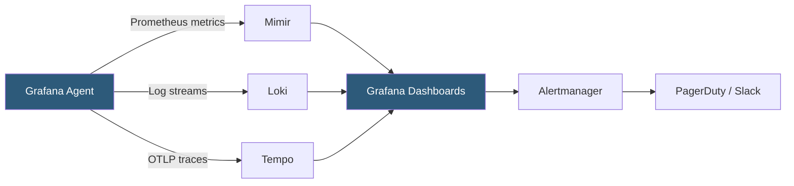

**Category:** Monitoring & Observability SaaS
**Difficulty:** Intermediate
**Reading time:** 6 min read

---

Grafana Cloud is a managed observability platform built on Grafana's open-source stack—Mimir for metrics, Loki for logs, Tempo for traces, and Grafana for visualization—delivered as a fully managed SaaS with a generous free tier. It enables teams to adopt OpenTelemetry and Prometheus-compatible monitoring without operating the underlying infrastructure.

- **Grafana** — Open-source visualization platform providing dashboards, alerting, and data source federation across metrics, logs, and traces
- **Mimir** — Horizontally scalable long-term storage backend for Prometheus metrics with full PromQL compatibility
- **Loki** — Log aggregation system using label-based indexing and LogQL query language optimized for Kubernetes log streams
- **Tempo** — Distributed tracing backend accepting OTLP, Jaeger, and Zipkin trace data with trace-to-metrics and trace-to-logs correlation
- **Grafana Agent** — Unified collector that scrapes Prometheus metrics, tails logs, and forwards traces to Grafana Cloud endpoints
- **Alertmanager** — Component handling alert routing, deduplication, grouping, and notification delivery for Prometheus-style alerting rules
- **Data Source Federation** — Grafana's ability to query multiple backends (Prometheus, Loki, Tempo, SQL, CloudWatch) in a single dashboard panel
- **Adaptive Metrics** — Feature that automatically identifies and removes unused metric series to reduce cardinality cost

Grafana Cloud provisions managed instances of Mimir, Loki, and Tempo for each tenant, exposing Prometheus-compatible remote_write endpoints for metrics, a Loki push endpoint for logs, and OTLP endpoints for traces. Teams configure the Grafana Agent—a single deployable collector—to scrape Prometheus metrics from application /metrics endpoints, tail log files or container stdout, and receive OTLP trace data from instrumented services, then forward all signals to their Grafana Cloud tenant.

Mimir stores metrics in object storage (S3 by default in the managed deployment) using the same storage format as Thanos, providing cost-efficient long-term retention at unlimited scale. Queries use standard PromQL, ensuring compatibility with existing Prometheus dashboards and alert rules. Multi-tenant separation prevents data leakage between organizational units.

Loki's indexing model dramatically differs from Elasticsearch-based log platforms. Rather than full-text indexing of every log word, Loki indexes only the label set (e.g., `{namespace="production", app="checkout"}`) and stores log lines in compressed chunks in object storage. This reduces index size by 90%+ but requires label-based pre-filtering before running regex searches, making label design a critical architectural decision.

Grafana's dashboard panels can combine data from all three backends in a single view. A service health panel might overlay Mimir error rate metrics, Loki error log count, and Tempo p99 latency time series in a single chart, providing immediate signal correlation without tool switching. Trace links in Loki log records and exemplar markers in Mimir metrics provide bidirectional navigation between telemetry types.

- Migrating from a self-hosted Prometheus stack to Grafana Cloud to eliminate operational overhead while preserving all existing dashboards and alert rules
- Building Kubernetes observability using the kube-prometheus-stack with remote_write to Grafana Cloud for managed long-term retention
- Using trace-to-log correlation in Tempo to jump from a slow trace span to the Loki log lines emitted during that request
- Enabling Adaptive Metrics to automatically identify and remove 30% of unused metric series, reducing MTS costs
- Federating Grafana Cloud metrics with a CloudWatch data source to build unified AWS and application dashboards

| Advantage | Disadvantage |
|-----------|--------------|
| Open-source stack eliminates vendor lock-in; self-hosting is always an option | Loki label-based indexing requires disciplined label design; full-text search is slower than Elasticsearch |
| PromQL compatibility preserves existing Prometheus dashboard and alert investment | Grafana agent configuration is complex; YAML-based pipeline setup requires expertise |
| Generous free tier enables proof-of-concept without procurement approval | Advanced features (Adaptive Metrics, Grafana OnCall, SLO) require paid tiers |
| Multi-signal correlation in a single Grafana dashboard reduces context switching | Managed Grafana Cloud UI responsiveness can lag for very high-cardinality PromQL queries |

- [Grafana Loki for Logs](grafana-loki-for-logs.md)
- [Grafana Tempo for Traces](grafana-tempo-for-traces.md)
- [Grafana Mimir for Metrics](grafana-mimir-for-metrics.md)

---
*Part of the [Monitoring & Observability SaaS](index.md) category · [Back to Master Index](../../index.md)*
