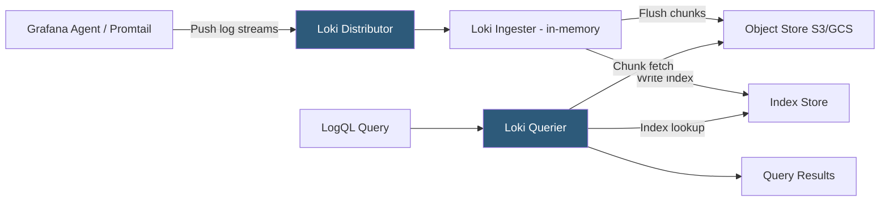

**Category:** Monitoring & Observability SaaS
**Difficulty:** Intermediate
**Reading time:** 6 min read

---

Grafana Loki is a horizontally scalable log aggregation system designed to be cost-efficient by indexing only log metadata labels rather than full log content. It uses LogQL for querying, integrates natively with Grafana dashboards, and is purpose-built for Kubernetes and cloud-native log streams where label-based organization is natural.

- **Label** — Key-value pair used to classify log streams (e.g., `{app="nginx", env="prod"}`); the only indexed metadata in Loki
- **Log Stream** — Sequence of log lines sharing an identical label set, stored together in compressed chunks
- **LogQL** — Loki's query language with two modes: log queries returning matching lines, and metric queries converting log data into time-series
- **Chunk** — Compressed block of log lines from a single stream stored in object storage (S3/GCS/Azure Blob)
- **Index** — Lightweight mapping from label combinations to chunk locations; significantly smaller than full-text inverted indexes
- **Promtail** — Legacy log collection agent for Loki that discovers and tails pod logs and files; superseded by the Grafana Agent
- **LogQL Metric Query** — Pipeline expression converting log line counts or extracted numeric values into PromQL-compatible metric queries for alerting
- **Ruler** — Loki component evaluating LogQL metric queries on a schedule to produce recording rules and fire alerts

Loki's core design principle is "like Prometheus, but for logs." Just as Prometheus identifies time series by label sets, Loki identifies log streams by label sets. The Grafana Agent or Promtail discovers log sources (Kubernetes pod logs via the Kubernetes API, file paths via glob patterns) and attaches labels derived from pod metadata (namespace, app name, container name) before pushing log lines to Loki's HTTP endpoint.

Loki's Distributor component validates incoming log streams and routes them to Ingesters based on label hash. Ingesters buffer incoming log lines in memory and periodically flush compressed chunks to object storage. Only the label-to-chunk mapping is written to the lightweight index store; the log content itself is never tokenized or inverted. This architecture reduces index storage by 90%+ compared to Elasticsearch, at the cost of requiring label-based pre-filtering for all queries.

A LogQL query has two phases. The label matcher (`{app="checkout",level="error"}`) selects matching streams using the index in microseconds. The log pipeline (`|= "database"`) then applies filter expressions (exact match, regex, or JSON field extraction) across the fetched chunk data. This means regex searches are fast within a stream but slow when applied to very broad label selections—making label design the most critical architectural decision for Loki performance.

LogQL metric queries apply the log pipeline and produce time-series data: `rate({app="checkout"}[5m])` computes the per-second log ingestion rate. These metric expressions feed Loki's Ruler component, which evaluates them on schedule to produce alerts and recording rules using the same Prometheus-compatible alert routing infrastructure.

- Collecting all Kubernetes pod logs with namespace, pod, and container labels for cluster-wide log search
- Using LogQL to extract HTTP status codes from Nginx access logs and create an error rate alert without a separate metric
- Correlating Grafana Loki log volume histogram with Prometheus error rate metrics on the same dashboard timeline
- Using label selectors to instantly filter 500 million daily log lines to a single microservice's error stream in milliseconds
- Building a centralized multi-team logging platform where each team queries only their labeled streams without infrastructure overhead

| Advantage | Disadvantage |
|-----------|--------------|
| Object storage-only content persistence reduces cost by 80–90% versus full-text index stores | Full-text search without label pre-filtering is slow; requires disciplined label taxonomy design |
| Label model mirrors Prometheus metric labeling, enabling a unified observability mental model | High-cardinality labels (user IDs, request IDs) cause index explosion; must use log line fields instead |
| Scales horizontally with object storage; no data migration for capacity expansion | LogQL lacks some search operators (fuzzy match, field-level scoring) available in Elasticsearch |
| Native Grafana integration enables log volume metrics on the same dashboards as infrastructure metrics | Loki does not parse structured fields at ingest; all field extraction happens at query time, increasing query CPU |

- [Grafana Cloud](grafana-cloud.md)
- [Grafana Tempo for Traces](grafana-tempo-for-traces.md)
- [Grafana Mimir for Metrics](grafana-mimir-for-metrics.md)

---
*Part of the [Monitoring & Observability SaaS](index.md) category · [Back to Master Index](../../index.md)*
