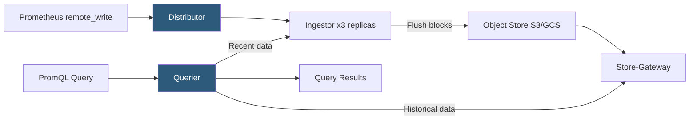

**Category:** Monitoring & Observability SaaS
**Difficulty:** Advanced
**Reading time:** 6 min read

---

Grafana Mimir is a horizontally scalable, multi-tenant long-term storage system for Prometheus metrics that provides PromQL compatibility with object storage-backed persistence. It solves Prometheus's single-node scalability and retention limitations while preserving the full Prometheus ecosystem of exporters, recording rules, and alerting rules.

- **Remote Write** — Prometheus feature that continuously replicates scraped metrics to a remote endpoint; the primary ingestion path for Mimir
- **Multi-Tenancy** — Mimir isolates metrics data between organizational units using tenant IDs, enabling a single cluster to serve multiple teams
- **Compactor** — Mimir component that merges small TSDB blocks in object storage into larger blocks, reducing query I/O and storage cost
- **Ruler** — Mimir component executing recording rules and alerting rules on schedule against stored metrics
- **Store-Gateway** — Mimir component that loads TSDB block metadata from object storage to serve historical range queries
- **Ingestor** — Mimir component that buffers recent metric samples in memory before flushing to object storage blocks
- **Cardinality** — Number of distinct label value combinations (metric time series); high cardinality is the primary cost and performance driver
- **Zone-Aware Replication** — Data placement strategy distributing replicas across availability zones to survive zone failures without data loss

Mimir's architecture decomposes the monolithic Prometheus server into specialized, horizontally scalable microservices. The Distributor receives remote_write requests from Prometheus instances, validates metric samples, and replicates them to a configurable number of Ingestor replicas (typically 3) using consistent hashing. This ensures that a specific metric time series always lands on the same Ingestor nodes, simplifying deduplication when multiple Prometheus instances scrape the same targets.

Ingestors buffer recent samples in memory using an in-process TSDB engine. When a block accumulates 2 hours of data, the Ingestor flushes it as an immutable Parquet-style TSDB block to object storage. The Compactor runs asynchronously to merge adjacent 2-hour blocks into larger 24-hour and 7-day blocks, reducing the number of S3 API calls required for range queries spanning long time windows and shrinking total storage through improved compression ratios.

Queries are handled by the Querier, which splits range queries into subqueries matching available block sizes, distributes them to Store-Gateways (for historical data) and Ingestors (for recent data), then merges and sorts results. Query-Frontend applies sharding to break large queries into smaller parallel subqueries, caches repeated query results, and provides per-tenant query concurrency limits to prevent a single heavy query from starving other tenants.

Multi-tenancy is enforced by requiring a `X-Scope-OrgID` header on all requests. Per-tenant limits control maximum cardinality, ingestion rate, and query time range, preventing one team's metric explosion from degrading the entire cluster.

- Replacing a federation of single-node Prometheus instances with a single globally replicated Mimir cluster for unified long-term metric storage
- Retaining 2 years of metrics in S3 at a fraction of the cost of maintaining Prometheus with local SSD storage
- Running global alerting rules across metrics scraped by multiple regional Prometheus instances via the shared Mimir Ruler
- Using multi-tenancy to give individual product teams isolated metric namespaces with per-tenant cardinality limits
- Enabling Grafana Cloud's metrics backend for teams that want managed Prometheus without operating Mimir themselves

| Advantage | Disadvantage |
|-----------|--------------|
| Scales writes and queries independently; no single-node bottleneck | Operationally complex; 8+ microservice components require Kubernetes expertise to deploy and tune |
| Object storage persistence reduces long-term retention cost dramatically | Object storage latency makes Mimir slower than local Prometheus for recent data queries |
| Full PromQL compatibility preserves existing dashboard and alert rule investment | Cardinality management requires ongoing engineering discipline; no automatic cardinality control |
| Multi-tenancy with per-tenant limits protects cluster stability | Zone-aware replication requires careful capacity planning; node count must be a multiple of zone count |

- [Grafana Cloud](grafana-cloud.md)
- [Grafana Loki for Logs](grafana-loki-for-logs.md)
- [Grafana Tempo for Traces](grafana-tempo-for-traces.md)

---
*Part of the [Monitoring & Observability SaaS](index.md) category · [Back to Master Index](../../index.md)*
