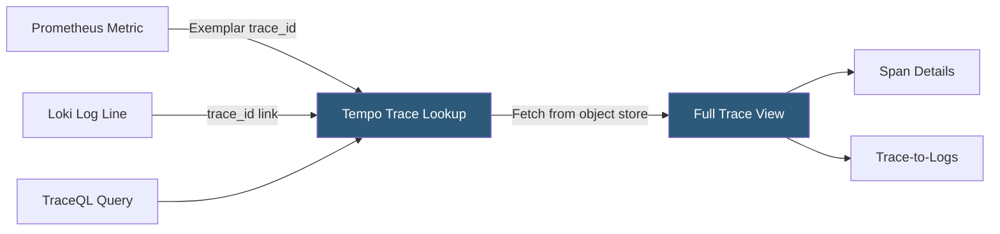

**Category:** Monitoring & Observability SaaS
**Difficulty:** Intermediate
**Reading time:** 5 min read

---

Grafana Tempo is a cost-efficient distributed tracing backend that stores trace data exclusively in object storage and retrieves individual traces by ID without maintaining a search index. It accepts traces from OpenTelemetry, Jaeger, Zipkin, and Zipkin formats, and integrates with Grafana to enable trace discovery via correlated metrics and logs.

- **TraceQL** — Tempo's query language for searching spans by attribute conditions, enabling trace search without a full-text index
- **Trace Discovery** — Pattern of finding traces via correlated Prometheus exemplars or Loki log trace IDs rather than direct trace search
- **Exemplar** — Data point attached to a Prometheus metric sample containing a trace ID, linking a specific high-latency request to its full trace
- **Object Storage Backend** — Tempo stores all trace data in S3, GCS, or Azure Blob without a search index, minimizing storage cost
- **Span Attributes** — Key-value metadata on trace spans queryable via TraceQL for targeted trace discovery
- **Parquet Format** — Columnar storage format used by Tempo for span data, enabling efficient TraceQL attribute queries
- **Trace-to-Metrics** — Feature generating span-derived RED metrics in Prometheus format for service-level alerting without separate APM instrumentation
- **Trace-to-Logs** — Contextual link from a Tempo trace span to Loki log lines sharing the same trace ID

Tempo's architecture centers on the observation that most trace analysis starts from a symptom—a slow metric, an error log, a user complaint—rather than a full-text search. By not maintaining an inverted search index, Tempo stores trace data at ~1/10th the cost of indexing platforms like Jaeger with Elasticsearch. All span data is written to object storage in Parquet columnar format grouped by trace ID.

Trace discovery in Tempo happens through three paths. First, Prometheus exemplars: when an application emits a histogram metric (e.g., `http_request_duration_seconds`), it can attach an exemplar containing the current trace ID to each observation. In Grafana, clicking on a metric spike opens the high-latency exemplar's trace directly in Tempo. Second, Loki log correlation: log lines containing a `trace_id` field render a clickable link in Grafana Log Observer that opens the corresponding Tempo trace. Third, TraceQL queries: Tempo's query language enables searching spans by attribute conditions (e.g., `{ span.http.status_code = 500 && duration > 2s }`) without a pre-built index, using the Parquet columnar format for efficient attribute filtering.

Trace-to-Metrics generates Prometheus-compatible RED metrics (rate, error rate, duration percentiles) from trace spans as they are ingested. This provides service-level metrics without requiring a separate APM agent instrumentation layer—valuable for teams that only have OpenTelemetry traces and want basic service health dashboards.

Tempo's ingest pipeline uses an ingester for in-memory buffering before flushing to object storage, with a distributor for write load balancing and a querier for trace retrieval. The compactor component periodically merges small object storage blocks to optimize query performance.

- Storing 30 days of full-fidelity trace data from a 100 RPS service at dramatically lower cost than Jaeger with Elasticsearch
- Clicking a P99 latency spike in a Grafana Mimir dashboard to jump directly to the exemplar trace that caused the spike
- Using TraceQL to find all traces where the checkout service called the payment API and took longer than 3 seconds
- Generating service RED metrics from traces via Trace-to-Metrics to populate service health dashboards without APM agent installation
- Correlating a Loki error log line to its complete distributed trace by clicking the trace_id link in the log detail view

| Advantage | Disadvantage |
|-----------|--------------|
| Object storage-only persistence reduces trace storage cost by 80–90% versus index-based backends | No search index means trace discovery requires correlated entry points (exemplars, log trace IDs, or TraceQL) |
| TraceQL enables attribute-based trace search without pre-indexing all span attributes | TraceQL attribute queries scan Parquet files; very broad queries over large time ranges are slow |
| Accepts OTLP, Jaeger, Zipkin without vendor-specific SDK changes | Trace-to-Metrics coverage depends on span attribute completeness; missing attributes produce incomplete metrics |
| Native Grafana integration provides exemplar click-through with zero configuration | Not suitable for organizations requiring full-text search or aggregated trace analytics without metric entry points |

- [Grafana Cloud](grafana-cloud.md)
- [Grafana Loki for Logs](grafana-loki-for-logs.md)
- [Grafana Mimir for Metrics](grafana-mimir-for-metrics.md)

---
*Part of the [Monitoring & Observability SaaS](index.md) category · [Back to Master Index](../../index.md)*
