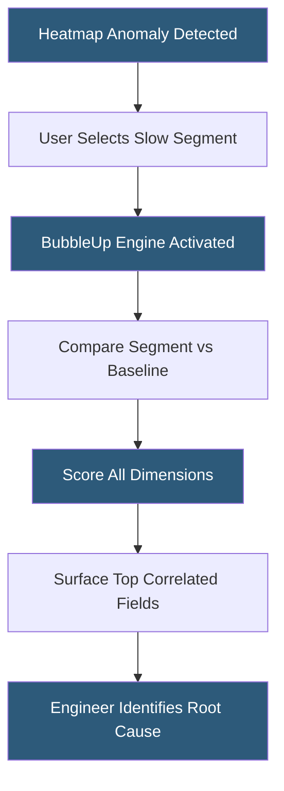

**Category:** Monitoring & Observability SaaS
**Difficulty:** Advanced
**Reading time:** 6 min read

---

Honeycomb BubbleUp is an automated investigation feature that surfaces the dimensions most correlated with anomalous behavior in your telemetry data. It eliminates manual bisection of high-cardinality fields by using statistical comparison to identify what is different about slow or erroring requests. Engineers can jump directly from symptom to root-cause hypothesis in seconds.

- **BubbleUp** — Honeycomb feature that highlights histogram segments deviating from baseline
- **Heatmap baseline** — the normal distribution of a metric used as comparison reference
- **High-cardinality field** — a column with many unique values (e.g., user_id, trace_id)
- **Statistical significance** — confidence threshold determining which fields are surfaced
- **Anomalous segment** — the subset of events being investigated (e.g., slow requests)
- **Dimension scoring** — ranking fields by how much their value distribution differs from baseline
- **Wide events** — Honeycomb's data model storing all context fields on every event

BubbleUp operates on Honeycomb's wide-event data model, where each event can carry dozens or hundreds of fields representing full request context. When an engineer notices an anomaly on a heatmap — such as elevated P99 latency — they drag-select the problematic region to define the "anomalous segment."

BubbleUp then performs a statistical comparison between events in that segment and a baseline of all events in the same time window. For every field in the dataset, it computes how the distribution of values in the anomalous segment differs from the baseline distribution. Fields where one or two values account for a disproportionate share of the slow requests receive high scores.

The results are presented as a ranked list of (field, value) pairs. For example, BubbleUp might reveal that 92% of slow requests have `region=us-east-1` and `db_pool=legacy`, while those values represent only 30% of all traffic. This directs investigation to specific infrastructure without requiring engineers to manually group-by each field.

Because Honeycomb stores raw events rather than pre-aggregated metrics, BubbleUp can operate on any field at query time — no pre-configuration of dashboards or alert dimensions is required. The analysis runs in real time against live data, typically completing in under 10 seconds for datasets of hundreds of millions of events.

- Identifying which customer segment experiences elevated error rates
- Pinpointing which microservice version introduced a latency regression
- Correlating deployment metadata with performance degradation
- Finding infrastructure-level patterns (region, host, container) in incidents
- Reducing mean time to resolution (MTTR) during on-call incidents

| Advantage | Disadvantage |
|-----------|--------------|
| Eliminates manual group-by iteration | Requires high-cardinality wide events to be effective |
| Real-time analysis on raw event data | Dataset must be in Honeycomb format — no external imports |
| No pre-configuration of dimensions needed | Can surface correlations that are not causal |
| Dramatically reduces MTTR | Cost scales with event volume and field cardinality |

- [Honeycomb Observability](honeycomb-observability.md)
- [Datadog APM (Application Performance)](datadog-apm-application-performance.md)
- [Grafana Tempo for Traces](grafana-tempo-for-traces.md)

---
*Part of the [Monitoring & Observability SaaS](index.md) category · [Back to Master Index](../../index.md)*
