**Category:** Monitoring & Observability SaaS
**Difficulty:** Advanced
**Reading time:** 7 min read

---

Honeycomb is an observability platform designed for high-cardinality, high-dimensionality event data that enables engineers to ask arbitrary questions about production systems without pre-defining what to measure. Built on a columnar event store, it processes wide event schemas with hundreds of fields at query speeds that traditional APM and metrics platforms cannot match.

- **Wide Event** — A single structured data record with dozens to hundreds of fields representing a complete unit of work (request, job, query)
- **High Cardinality** — Ability to efficiently query fields with millions of unique values (user IDs, trace IDs, customer plans)
- **BubbleUp** — Honeycomb's correlation analysis feature that automatically identifies which field values are over-represented in a selected anomalous subset compared to baseline
- **Trace Waterfall** — Distributed trace visualization showing span hierarchy, durations, and field values inline
- **SLO Management** — Built-in service level objective tracking using Honeycomb event data without separate metric pre-aggregation
- **Sampling** — Honeycomb supports both head-based and dynamic tail-based sampling via the Refinery proxy to control ingest cost
- **Refinery** — Honeycomb's open-source tail-based sampling proxy that makes retain/drop decisions after seeing a complete trace
- **OpenTelemetry SDK** — Honeycomb accepts OTLP trace and metric data, with Honeycomb-provided distro packages adding configuration defaults

```mermaid
graph LR
    A[OTel Instrumented Service] -->|Wide events| B[Refinery Sampler]
    B -->|Sampled events| C[Honeycomb Ingest]
    C --> D[Columnar Event Store]
    D --> E[Query UI - HEATMAP/P99]
    E -->|Select anomalous region| F[BubbleUp Analysis]
    F --> G[Correlated Field Values]
    style D fill:#2d5a7a,color:#fff
    style F fill:#2d5a7a,color:#fff
```

Honeycomb's data model centers on the wide event: every request, database query, or background job emits a single structured JSON record with all relevant fields attached—user ID, plan tier, feature flags, request duration, database query count, upstream service latency, error message. Traditional APM tools pre-aggregate these dimensions into fixed metrics; Honeycomb stores raw events and runs columnar queries at analysis time.

The columnar store organizes event fields into column segments, allowing queries to read only the columns involved in a computation. A query aggregating P99 latency grouped by `customer_tier` scans only those two columns across millions of events, returning results in seconds regardless of how many other fields each event contains. This enables ad-hoc queries on any field combination without schema design upfront.

BubbleUp is Honeycomb's signature analysis feature. When an engineer identifies an anomalous time range in a visualization—a latency spike, an error rate increase—BubbleUp automatically compares the statistical distribution of every field value in the selected region against the baseline window. Fields where a specific value (e.g., `db_replica=primary`, `feature_flag=new_checkout`, `region=ap-southeast-1`) is over-represented in the anomalous subset are ranked by statistical significance, surfacing probable correlates without manual hypothesis testing.

Refinery is a stateful proxy deployed between instrumented services and Honeycomb's intake. It buffers spans for a configurable window, waits until a trace is complete, then evaluates tail-based sampling rules—retaining 100% of error traces, 100% of slow traces, and a configurable fraction of normal traces. This ensures representative sampling of the long tail while controlling ingest volume and cost.

- Using BubbleUp to identify that 95% of timeout errors correlate with `customer_plan=enterprise` and `db_shard=eu-west-2` within 60 seconds of a production incident
- Querying P99 latency segmented by 50+ feature flag combinations simultaneously to validate a dark launch's performance impact
- Using Refinery to retain 100% of traces with errors and only 1% of healthy traces, reducing ingest cost by 80% without losing error visibility
- Building SLOs directly on Honeycomb event data without pre-defining latency buckets in code
- Debugging a rare race condition that affects 0.01% of requests by querying raw events without sampling interference

| Advantage | Disadvantage |
|-----------|--------------|
| BubbleUp eliminates manual hypothesis testing; surfaces correlates in under a minute | Wide event model requires instrumentation investment; engineers must add relevant fields to events |
| High-cardinality field queries are first-class; no pre-aggregation or index design required | Pricing is based on events ingested; high-volume services require Refinery sampling to control costs |
| Raw event storage enables retroactive analysis of issues not anticipated at instrumentation time | No built-in infrastructure metrics; Honeycomb complements but does not replace infrastructure monitoring |
| Refinery's tail-based sampling preserves complete error and anomaly traces regardless of sample rate | Refinery adds operational complexity and memory requirements for high-volume distributed deployments |

- [Honeycomb BubbleUp Analysis](honeycomb-bubbleup-analysis.md)
- [Datadog APM (Application Performance)](datadog-apm-application-performance.md)
- [Grafana Tempo for Traces](grafana-tempo-for-traces.md)

---
*Part of the [Monitoring & Observability SaaS](index.md) category · [Back to Master Index](../../index.md)*
