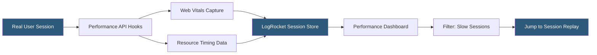

**Category:** Monitoring & Observability SaaS
**Difficulty:** Intermediate
**Reading time:** 5 min read

---

LogRocket's performance monitoring layer measures Web Vitals, JavaScript render times, and network latency for every recorded session, correlating performance metrics directly with the user experience captured in replay. Unlike synthetic monitoring, LogRocket captures real-user performance data from production sessions, enabling teams to identify the exact sessions where performance degradations occur.

- **Core Web Vitals** — LCP, FID/INP, and CLS metrics measured in real user sessions
- **Time to First Byte (TTFB)** — server response time captured per navigation event
- **Long task detection** — JavaScript tasks exceeding 50ms flagged as performance blockers
- **Resource timing** — per-asset load duration from the browser's Performance API
- **Slow session threshold** — configurable P75 latency value used to segment sessions
- **Performance segments** — filtering sessions by device type, browser, region, or connection
- **Correlation view** — side-by-side comparison of performance timeline and session replay

LogRocket instruments the browser's PerformanceObserver API to capture Core Web Vitals and navigation timing data in every recorded session. LCP, FID, INP, and CLS values are tagged to the session record along with device type, effective connection type (via Network Information API), browser version, and geographic region derived from IP.

Long tasks — JavaScript execution blocking the main thread for more than 50ms — are detected via the Long Tasks API and surfaced in the session timeline as orange bars, allowing developers to identify render-blocking components or third-party scripts. Resource timing entries record load duration for every script, stylesheet, image, and API call, making it possible to detect a slow CDN or a newly added analytics pixel causing LCP regression.

The performance dashboard aggregates metrics across all sessions using percentile distributions (P50, P75, P95) and allows filtering by user segments, page routes, release versions, and date ranges. Critically, every data point links directly to individual sessions where that performance was observed. A developer investigating a spike in P95 LCP can click through to watch the five slowest sessions in the replay player, seeing exactly what the user was doing, what network requests were in-flight, and whether any JavaScript errors coincided with the slow render.

- Identifying which device or connection type experiences the worst LCP scores
- Finding which third-party scripts contribute most to main-thread blocking
- Validating that a performance optimization improved real-user metrics post-deploy
- Correlating slow page loads with elevated error rates or form abandonment
- Segmenting Web Vitals scores by geographic region for CDN tuning

| Advantage | Disadvantage |
|-----------|--------------|
| Real-user data vs synthetic probe limitations | Session sampling reduces coverage of tail latencies |
| Direct link from metric to replay session | Performance data retention limited by session plan |
| Long task detection without separate tooling | No server-side tracing — frontend only |
| Segment by user attributes and release version | Aggregate dashboards less mature than dedicated RUM tools |

- [LogRocket Session Recording](logrocket-session-recording.md)
- [Datadog Real User Monitoring](datadog-real-user-monitoring.md)
- [Datadog Synthetic Monitoring](datadog-synthetic-monitoring.md)

---
*Part of the [Monitoring & Observability SaaS](index.md) category · [Back to Master Index](../../index.md)*
