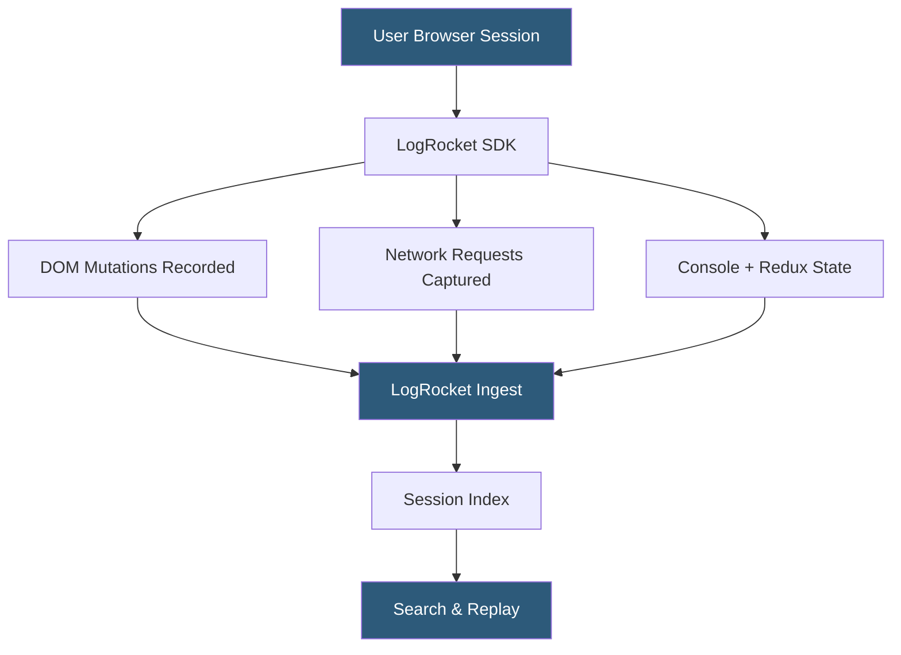

**Category:** Monitoring & Observability SaaS
**Difficulty:** Intermediate
**Reading time:** 6 min read

---

LogRocket is a frontend observability platform that combines session replay, performance monitoring, and error tracking in a single product. It records every user session as a pixel-perfect video reproduction backed by full network request logs, Redux/Vuex state snapshots, and JavaScript console output, giving product and engineering teams complete visibility into the user experience.

- **Session replay** — visual reproduction of the user's browser session using DOM recording
- **Network request logging** — capture of all XHR/fetch calls with request/response bodies
- **Redux plugin** — integration that captures state mutations alongside the session timeline
- **Rage click** — detection of rapid repeated clicks indicating user frustration
- **Segment identification** — tagging sessions with user ID and custom attributes for filtering
- **Heatmaps** — aggregated click and scroll density maps built from session data
- **Fuzzy search** — full-text search across session metadata, URLs, and console messages

LogRocket's JavaScript SDK instruments the browser by intercepting DOM mutations via MutationObserver, wrapping the XMLHttpRequest and Fetch APIs to log network activity, and hooking into the console and error event handlers. The combined event stream is serialized into a compact binary format and streamed to LogRocket's ingestion API with minimal performance impact (the SDK is typically under 50 KB gzipped).

Unlike simple video recording, LogRocket rebuilds sessions from structured DOM events, meaning replays are searchable and filterable by any metadata attribute. Engineers can search for sessions where a specific API endpoint returned a 500 status, where a JavaScript error was thrown, or where the user clicked a particular button more than three times (rage click detection).

Network request logging captures full request and response payloads by default, with configurable sanitization rules to mask sensitive headers and body fields. For React applications, a Redux middleware plugin records every dispatched action and resulting state tree, allowing developers to replay not just the visual rendering but also the exact state transitions that preceded a bug.

LogRocket's machine learning models analyze session patterns to surface anomalies — degraded performance, elevated error rates in specific geographic regions, or new UI patterns correlating with conversion drops — without requiring manual dashboard configuration.

- Diagnosing why users are abandoning a multi-step form
- Reproducing a state management bug reported by a specific enterprise customer
- Analyzing which rage-click elements indicate UX friction
- Correlating slow API responses with user drop-off in e-commerce flows
- Supporting customer success with session links during ticket resolution

| Advantage | Disadvantage |
|-----------|--------------|
| Full network request capture alongside replay | Pricing based on session volume can be expensive at scale |
| Redux/Vuex state recording for SPA debugging | Network payload capture must be carefully sanitized |
| ML-powered session anomaly detection | No backend tracing — frontend focused only |
| Rage click and frustration signal detection | GDPR compliance requires deliberate privacy configuration |

- [LogRocket Performance Monitoring](logrocket-performance-monitoring.md)
- [Sentry Session Replay](sentry-session-replay.md)
- [Datadog Real User Monitoring](datadog-real-user-monitoring.md)

---
*Part of the [Monitoring & Observability SaaS](index.md) category · [Back to Master Index](../../index.md)*
