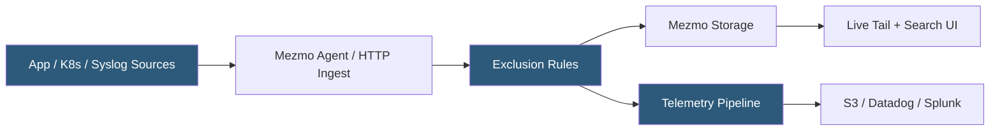

**Category:** Monitoring & Observability SaaS
**Difficulty:** Intermediate
**Reading time:** 5 min read

---

Mezmo, formerly LogDNA, is a cloud-native log management and pipeline platform that ingests logs from applications, servers, and Kubernetes clusters for real-time streaming search and long-term archiving. Its newer Telemetry Pipeline product extends beyond storage to allow transformation, filtering, and routing of log streams to multiple downstream destinations without modifying application code.

- **Log line** — an individual log event stored with timestamp, level, host, application, and message fields
- **Dynamic field extraction** — automatic parsing of JSON and structured log formats without preconfiguration
- **Exclusion rules** — server-side filters that drop specified log patterns before ingestion billing
- **Telemetry Pipeline** — Mezmo's stream processing layer for transforming and routing log data
- **Live tail** — real-time streaming view of incoming log lines in the browser
- **Graph** — metric derived from log lines using statistical aggregation over time windows
- **Archiving** — export of log data to customer-owned S3, Azure Blob, or Google Cloud Storage buckets

Mezmo collects logs through lightweight agents (Linux daemon, Kubernetes DaemonSet, Docker log driver) or via HTTPS API endpoints. Logs arrive as raw text or structured JSON; the platform parses JSON fields automatically and makes them available as indexed fields without schema definition. Syslog, Heroku logplex, and custom HTTP sources are natively supported.

Server-side exclusion rules allow teams to drop high-volume, low-value log lines (health check pings, static asset requests) before they count against ingestion quotas, reducing cost without modifying application logging configuration. Remaining lines are stored in Mezmo's time-series index with full-text search capabilities and a retention period configured per account.

The Mezmo web UI provides live tail for streaming real-time logs, a search interface using field-based queries (`level:error app:payment-service`), and graph widgets that derive metrics from log patterns (e.g., count of lines matching a regex per minute). Alerts trigger on log pattern matches or metric threshold crossings.

The Telemetry Pipeline (Mezmo's newer product layer) transforms the platform from a storage destination into a stream processing system. Log events can be parsed, enriched, filtered, sampled, and routed to multiple destinations — Mezmo storage, Datadog, Splunk, S3, or custom HTTP endpoints — using a visual pipeline builder or YAML configuration. This allows organizations to centralize log collection while selectively routing security logs to a SIEM and developer logs to a cheaper archival store.

- Aggregating Kubernetes pod logs from multi-cluster deployments
- Reducing log ingestion costs by excluding noisy health-check traffic
- Routing security-relevant logs to a SIEM while archiving all logs to S3
- Building log-based metrics and alerts without a separate monitoring tool
- Providing development teams with self-service log search across all services

| Advantage | Disadvantage |
|-----------|--------------|
| Simple setup with Kubernetes DaemonSet in minutes | Less sophisticated analytics than Datadog or Elastic |
| Cost-effective exclusion rules before billing | Telemetry Pipeline features require higher-tier plan |
| Telemetry Pipeline enables multi-destination routing | Search query language less expressive than Kibana or Splunk |
| Live tail for real-time debugging | Retention limits on lower plans may not meet compliance needs |

- [Papertrail Log Aggregation](papertrail-log-aggregation.md)
- [Better Stack Logging](better-stack-logtail-logging.md)
- [Grafana Loki for Logs](grafana-loki-for-logs.md)

---
*Part of the [Monitoring & Observability SaaS](index.md) category · [Back to Master Index](../../index.md)*
