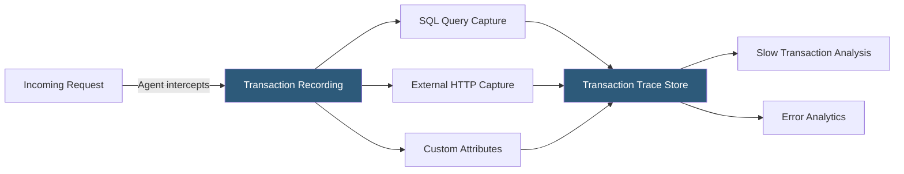

**Category:** Monitoring & Observability SaaS
**Difficulty:** Intermediate
**Reading time:** 5 min read

---

New Relic APM provides deep application performance visibility through automatic instrumentation of web transactions, background jobs, and external service calls. It surfaces latency percentiles, throughput trends, error analytics, and transaction traces to help engineering teams diagnose performance regressions and optimize application behavior.

- **Transaction** — A unit of work tracked by New Relic, typically an HTTP request or background job, measuring response time and throughput
- **Transaction Trace** — Detailed recording of a slow transaction capturing the call stack, SQL queries, and external calls with timing breakdowns
- **Apdex Score** — Application Performance Index; a standardized metric rating user satisfaction as Satisfied/Tolerating/Frustrated based on a configurable response time threshold
- **Error Analytics** — Aggregated view of exceptions with fingerprinting, stack traces, and affected transaction counts
- **Distributed Tracing** — Cross-service trace assembly linking spans from multiple services into a complete request trace
- **Key Transactions** — Subset of transactions marked for individual SLO tracking and alerting below the application aggregate level
- **Deployments** — Marker events injected at release time that overlay on performance graphs to correlate code changes with metric changes
- **Service Levels** — SLI/SLO configuration tracking good response rate and latency percentiles against defined error budgets

New Relic APM agents instrument application code at the framework level. For web frameworks (Rails, Django, Express, Spring), the agent wraps request handlers to measure total transaction time and segment it into application code, database, external HTTP, and framework overhead. SQL queries are captured with execution time and query text (with configurable obfuscation) and aggregated into the slow queries report.

Transaction traces are recorded for requests exceeding a configurable slow transaction threshold (default: 4× Apdex T). Each trace captures a waterfall of segments showing exactly where time was spent. The agent also samples a percentage of all transactions for distributed tracing, injecting W3C TraceContext headers into outbound calls so downstream services contribute spans to the same trace.

Apdex provides a normalized satisfaction metric rather than raw percentile latency. A transaction completing within the Apdex T threshold (e.g., 500ms) counts as Satisfied; within 4× T (2 seconds) as Tolerating; beyond as Frustrated. The resulting 0–1 score is intuitive for executive reporting and SLO definition.

Error Analytics groups exceptions by class name and message into fingerprinted error groups, suppressing duplicates to surface distinct error patterns. Each error group shows the affected transaction, occurrence count, user impact estimate, and full stack trace. New Relic's Errors Inbox provides a triage workflow with GitHub/Jira integration for error ownership assignment.

Deployment markers—sent via an API call in the CI/CD pipeline—draw vertical lines on all APM charts, enabling instant visual correlation between a code release and any subsequent performance degradation.

- Identifying that 99th percentile API latency doubled after a library upgrade using pre/post deployment comparison
- Using Key Transactions to set tighter SLOs on the payment endpoint than the application average
- Tracing slow database queries generated by an ORM through transaction traces without adding logging code
- Configuring Apdex T at 200ms to capture subtle frontend performance regressions invisible in p50 metrics
- Using Errors Inbox to assign JavaScript exception ownership to the frontend team in a single workflow

| Advantage | Disadvantage |
|-----------|--------------|
| Apdex provides a simple, business-friendly performance score | Proprietary metric; difficult to compare across organizations or tools |
| Transaction traces require no code changes for most frameworks | Trace sampling can miss infrequent slow transactions in low-traffic services |
| Deployment markers integrate via simple API call in any CI/CD system | Agent auto-instrumentation can conflict with application proxies and custom middleware |
| Service Levels provide built-in SLO error budget tracking | SLO configuration UI is less flexible than custom PromQL-based SLOs in Prometheus/Grafana |

- [New Relic Observability Platform](new-relic-observability-platform.md)
- [New Relic Browser Monitoring](new-relic-browser-monitoring.md)
- [New Relic Logs](new-relic-logs.md)

---
*Part of the [Monitoring & Observability SaaS](index.md) category · [Back to Master Index](../../index.md)*
