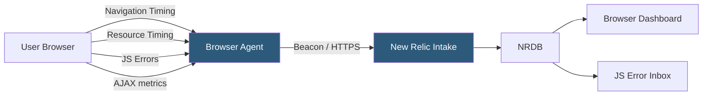

**Category:** Monitoring & Observability SaaS
**Difficulty:** Beginner
**Reading time:** 5 min read

---

New Relic Browser Monitoring instruments web pages to capture real-user performance data including page load timing, JavaScript errors, AJAX call performance, and Core Web Vitals. It provides geographic and browser-segmented performance analysis to guide frontend optimization priorities.

- **Browser Agent** — JavaScript snippet injected into page HTML that instruments Navigation Timing, Resource Timing, and PerformanceObserver APIs
- **Page View** — Single navigation event recording full load timing breakdown from DNS through DOM complete
- **AJAX Request** — Instrumented XHR or Fetch call tracking time, status, payload size, and error state
- **JavaScript Error** — Uncaught exception captured with stack trace, browser version, and affected page URL
- **Session Trace** — 10-minute detailed recording of page lifecycle events for deep load analysis
- **Core Web Vitals** — LCP, FID/INP, and CLS measurements per page view linked to Google's page experience score
- **Geo Filtering** — Segmentation of performance data by country, US state, or metro area to identify regional degradation
- **SPA Monitoring** — Route change tracking for single-page applications using History API or hash change events

The Browser agent is a small JavaScript file loaded in the page's `<head>` section, either injected automatically by a server-side APM agent or added manually as a snippet. It wraps the browser's XMLHttpRequest constructor and the Fetch API to intercept all network calls, recording URL, method, duration, and response status for each request.

Navigation Timing API data is captured when the window load event fires, providing a complete breakdown of the page load including redirects, DNS lookup, TCP handshake, server response time, DOM processing, and resource loading. This data is enriched with the page URL, referring URL, user agent, and geographic metadata before being transmitted to New Relic as a beacon request.

For single-page applications, the agent monitors the History API's pushState and replaceState methods and hash change events to detect client-side route transitions. When a route change occurs, a new virtual page view is recorded, enabling accurate bounce rates and page-level metrics in React, Vue, and Angular applications.

JavaScript errors are captured via a global `window.onerror` handler and Promise rejection listeners. Each error is enriched with a fingerprint hash, the browser stack trace, the page URL where it occurred, and demographic data (browser type, OS, device category). Errors are grouped into distinct error classes in the Errors Inbox, suppressing noise from repeated identical exceptions while surfacing unique root causes.

Session Trace records a timeline of all page events—resource loads, AJAX calls, user interactions, and JavaScript errors—for sessions where a slow page load or error is detected, providing a forensic view without continuous recording overhead.

- Identifying that 95th percentile page load time is 3× higher for Safari on iOS than Chrome on Android
- Detecting a JavaScript error introduced by a third-party tag manager affecting 5% of checkout sessions
- Correlating slow AJAX calls to the recommendations API with a backend service degradation
- Using geo-segmentation to identify a CDN PoP failure causing elevated load times in Southeast Asia
- Tracking Core Web Vitals trends over 30 days to validate the impact of image optimization work

| Advantage | Disadvantage |
|-----------|--------------|
| No backend code changes required; snippet injection covers all pages | Third-party scripts and browser extensions can interfere with timing accuracy |
| Geo and browser segmentation pinpoints issues invisible in aggregate metrics | SPA monitoring requires framework-specific configuration for accurate route tracking |
| Errors Inbox integrates with Jira/GitHub for frontend error triage workflow | Session Trace recording is sampling-based; not every slow session generates a trace |
| Core Web Vitals integration aligns monitoring with Google SEO signals | Browser agent adds a synchronous load dependency if not deferred properly |

- [New Relic APM](new-relic-apm.md)
- [New Relic Mobile Monitoring](new-relic-mobile-monitoring.md)
- [Datadog Real User Monitoring](datadog-real-user-monitoring.md)

---
*Part of the [Monitoring & Observability SaaS](index.md) category · [Back to Master Index](../../index.md)*
