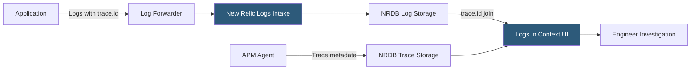

**Category:** Monitoring & Observability SaaS
**Difficulty:** Beginner
**Reading time:** 5 min read

---

New Relic Logs provides centralized log ingestion, search, and analysis within the New Relic One platform, enabling direct correlation between log lines and APM traces, infrastructure metrics, and browser errors. Its consumption-based pricing model and OpenTelemetry support make it a flexible choice for teams already invested in the New Relic ecosystem.

- **Log Ingest** — Pipeline accepting logs via New Relic agents, Fluentd/Fluent Bit plugins, the Logs API, or cloud provider forwarding
- **Logs in Context** — Feature automatically linking log records to the APM transaction trace active when the log was emitted
- **Log Parsing** — Automatic JSON parsing and custom Grok rule configuration for field extraction from unstructured logs
- **Partitions** — Data organization units controlling retention period and query scope, analogous to log indexes
- **Obfuscation** — Server-side masking of sensitive field values (SSNs, card numbers) before log storage
- **Live Archives** — Configurable long-term storage tier extending retention from 30 days to multiple years at reduced query cost
- **Drop Filter** — Ingest-time rule discarding matching log records before storage to control costs
- **Log Patterns** — Automated clustering of similar log messages to surface anomalies in high-volume log streams

New Relic Logs ingests data through flexible collection paths. The New Relic Infrastructure agent includes a log forwarding plugin that tails files and Docker container logs. Fluent Bit and Fluentd output plugins forward logs from Kubernetes pods. AWS Lambda log forwarding captures CloudWatch Logs streams. For direct application logging, the Logs API accepts JSON payloads via HTTPS.

Logs in Context is the flagship integration feature. When a New Relic APM agent instruments a service, it automatically injects the current trace ID and span ID into the application's logging context (MDC for Java, contextvars for Python, etc.). When these enriched logs are ingested, New Relic correlates them by trace ID, enabling a one-click jump from a slow trace span to the log lines emitted during that specific request.

Log Patterns uses a clustering algorithm to group structurally similar messages—reducing millions of lines to hundreds of distinct patterns. Each pattern shows occurrence count, rate of change, and representative samples. Patterns with sudden frequency spikes or new patterns not seen in the baseline period are highlighted as anomalies, providing signal in high-volume log streams without manual search.

Drop filters and obfuscation rules are applied at ingest time before data reaches NRDB, ensuring compliance data never persists in storage. Drop filters match on NRQL WHERE-style expressions and are effective for reducing cost on high-volume health check or debug log categories.

- Jumping from a slow APM transaction trace directly to the application logs emitted during that request via Logs in Context
- Using Log Patterns to detect a new exception type appearing in production without writing a search query
- Applying drop filters to discard 95% of Kubernetes pod health probe logs while retaining all ERROR-level logs
- Configuring obfuscation to mask email addresses in authentication service logs for GDPR compliance
- Forwarding CloudWatch Logs from Lambda functions into New Relic for unified serverless observability

| Advantage | Disadvantage |
|-----------|--------------|
| Logs in Context provides seamless trace-to-log correlation without manual search | Requires APM agent integration for full Logs in Context; log-only users lose this key feature |
| Consumption pricing avoids per-node fees for ephemeral container workloads | Ingest costs are unpredictable for bursty log generators without drop filters and budgets |
| Log Patterns surfaces anomalies in noisy streams without custom alerting rules | Pattern clustering is probabilistic; rare but important log classes may merge incorrectly |
| NRQL query syntax is consistent with metrics and traces; no separate query language | NRQL lacks some log-specific operators (fuzzy search, multi-line event grouping) available in Elastic |

- [New Relic APM](new-relic-apm.md)
- [New Relic Observability Platform](new-relic-observability-platform.md)
- [Datadog Log Management](datadog-log-management.md)

---
*Part of the [Monitoring & Observability SaaS](index.md) category · [Back to Master Index](../../index.md)*
