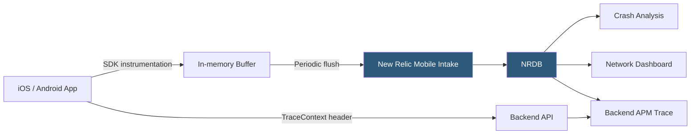

**Category:** Monitoring & Observability SaaS
**Difficulty:** Intermediate
**Reading time:** 5 min read

---

New Relic Mobile Monitoring provides visibility into iOS and Android application performance by instrumenting network requests, crash reporting, and user interaction timing. It correlates mobile events with backend APM traces to deliver end-to-end request visibility from device to server.

- **Mobile SDK** — Native libraries for iOS (Swift/Objective-C) and Android (Java/Kotlin) that auto-instrument HTTP calls and lifecycle events
- **Crash Report** — Symbolicated stack trace capturing the crash thread state, device metadata, and preceding events
- **Handled Exception** — Non-fatal exception recorded with context for stability monitoring without crash rate inflation
- **Network Request** — HTTP/HTTPS call from the mobile app tracked for URL, method, response code, bytes transferred, and duration
- **Interaction Trace** — Timeline of method execution during a user interaction, capturing slowdowns in UI threads
- **Mobile Session** — Sequence of screen views and interactions for a single app launch, supporting retention and engagement analysis
- **App Launch Time** — Cold and warm launch duration from process start to first interactive frame
- **HTTP Error Rate** — Percentage of network requests resulting in 4xx/5xx responses, indicating backend or connectivity issues

The New Relic Mobile SDK is added to the iOS or Android project as a library dependency. For iOS, Swift method swizzling intercepts URLSession calls; for Android, Gradle build instrumentation adds bytecode hooks to OkHttp and HttpURLConnection. This approach requires no manual code changes for network monitoring in most applications.

The SDK buffers collected data in memory and flushes it to New Relic's intake at regular intervals (default: 60 seconds) or on app backgrounding to minimize battery and network impact. Data sent over cellular is compacted and compressed to reduce overhead on metered connections.

Crash reporting captures uncaught exceptions and fatal signals using platform-specific crash handlers. iOS crashes are captured via signal handlers and NSException monitoring; Android crashes use the Thread.UncaughtExceptionHandler API. Crash reports include a full symbolicated stack trace (requiring dSYM files for iOS or ProGuard mappings for Android), device model, OS version, memory state, and a timeline of the preceding 30 seconds of interaction events.

Distributed tracing integration injects W3C TraceContext headers into all instrumented network requests. When the backend service is instrumented with a New Relic APM agent, the trace is assembled end-to-end, showing the backend database query or external API call that contributed to a slow mobile response. This cross-layer visibility is unavailable when analyzing mobile or backend telemetry in isolation.

- Identifying that the product image loading screen takes 2× longer on Android 10 devices due to TLS 1.3 negotiation overhead
- Detecting a 15% crash rate increase after an iOS release using symbolicated stack traces to pinpoint the null dereference
- Monitoring backend HTTP error rates segmented by API endpoint to identify when backend deployments break mobile app functionality
- Correlating a mobile session network call to a slow backend database query via distributed tracing
- Tracking cold launch time improvements across app releases to validate startup optimization work

| Advantage | Disadvantage |
|-----------|--------------|
| Automatic HTTP instrumentation covers most networking libraries without code changes | Requires dSYM/ProGuard mapping uploads in CI/CD pipeline for symbolicated crash reports |
| Distributed tracing links mobile network calls to backend service spans | SDK initialization adds to app launch time; must be deferred if sub-100ms cold start is critical |
| Crash rate trending by app version guides roll-back vs. fix-forward decisions | Interaction traces require manual instrumentation of custom UI components |
| Handled exception tracking improves stability visibility without affecting crash KPIs | Data buffering means last-minute events before a force-kill may not be transmitted |

- [New Relic Browser Monitoring](new-relic-browser-monitoring.md)
- [New Relic APM](new-relic-apm.md)
- [New Relic Observability Platform](new-relic-observability-platform.md)

---
*Part of the [Monitoring & Observability SaaS](index.md) category · [Back to Master Index](../../index.md)*
