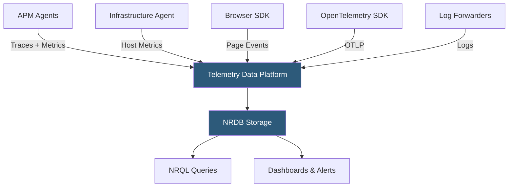

**Category:** Monitoring & Observability SaaS
**Difficulty:** Intermediate
**Reading time:** 6 min read

---

New Relic is a full-stack observability platform built on a unified telemetry data store that ingests metrics, events, logs, and traces (MELT) from any source. Its consumption-based pricing model, open-source instrumentation support, and AI-powered analysis engine make it a popular choice for organizations consolidating observability tooling.

- **Telemetry Data Platform** — New Relic's unified backend that stores all MELT data in a single NRDB (New Relic Database) accessible via NRQL
- **NRQL** — New Relic Query Language; SQL-like syntax for querying telemetry data to build dashboards and alerts
- **New Relic One** — The unified UI shell providing navigation across APM, infrastructure, browser, logs, and synthetic monitors
- **Entity** — Any monitored component (host, service, container, browser application) automatically discovered and linked in the entity graph
- **New Relic Agent** — Language-specific library installed into application runtimes for automatic instrumentation
- **Alerts & AI** — Notification system powered by Applied Intelligence (AIOps) that correlates related alerts into incidents and suggests probable root causes
- **OpenTelemetry Integration** — Native OTLP endpoint accepting traces, metrics, and logs from OpenTelemetry-instrumented services
- **Data Ingest Pricing** — Billing model charging per GB ingested rather than per host, enabling cost alignment with actual observability usage

New Relic collects telemetry through a combination of proprietary agents and open standards. Language agents (Java, Python, .NET, Node.js, Ruby, PHP, Go) auto-instrument popular frameworks using bytecode manipulation or middleware injection, generating spans, transaction traces, and custom metrics without code changes. The Infrastructure agent runs on hosts and collects OS metrics, network stats, and integrates with cloud provider APIs for managed service coverage.

All collected data flows into the Telemetry Data Platform's NRDB—a purpose-built distributed time-series and event database capable of querying billions of data points with second-scale response times. NRDB indexes every attribute, enabling arbitrary filtering and grouping without pre-aggregation, which is critical for ad-hoc incident investigation.

Applied Intelligence (AI) sits above the data layer and continuously runs correlation algorithms to group related alert conditions into unified incidents. When an anomaly is detected, AI surfaces suggested probable causes by analyzing recent changes—deployments, configuration drifts, upstream dependency degradations—reducing the mean time to identification. Proactive detection models trained on service baselines fire before user-defined thresholds are breached.

New Relic's consumption pricing charges for data ingested above a free monthly allotment. This model benefits organizations with bursty workloads but can produce unpredictable bills for high-cardinality tracing without ingest controls. The OpenTelemetry-native OTLP endpoint allows gradual migration from proprietary agents while maintaining full query capability.

- Consolidating APM, infrastructure, logs, and synthetics into a single pane of glass to reduce context switching
- Querying raw NRQL to build custom cost allocation dashboards segmented by team and environment tag
- Using Applied Intelligence to automatically correlate a database alert with an upstream deployment alert into a single incident
- Onboarding OpenTelemetry-instrumented services without vendor lock-in while retaining full NRQL query capability
- Setting consumption budgets and ingest drop rules to control costs for verbose microservice traces

| Advantage | Disadvantage |
|-----------|--------------|
| Consumption pricing aligns cost with actual usage; beneficial for variable workloads | Ingest costs can spike unexpectedly with high-cardinality trace data; requires budget alerts |
| NRQL enables powerful ad-hoc queries without pre-defining aggregations | NRQL has a learning curve for teams accustomed to SQL or PromQL |
| Native OTLP support enables vendor-neutral instrumentation strategy | Some advanced features (Distributed Tracing UI, Errors Inbox) require proprietary agents for full fidelity |
| Entity graph auto-discovers relationships without manual topology configuration | Entity relationship inference can be inaccurate for complex service meshes requiring manual curation |

- [New Relic APM](new-relic-apm.md)
- [New Relic Logs](new-relic-logs.md)
- [Datadog Infrastructure Monitoring](datadog-infrastructure-monitoring.md)

---
*Part of the [Monitoring & Observability SaaS](index.md) category · [Back to Master Index](../../index.md)*
