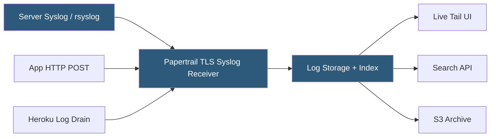

**Category:** Monitoring & Observability SaaS
**Difficulty:** Beginner
**Reading time:** 5 min read

---

Papertrail (owned by SolarWinds) is a hosted log aggregation service that receives logs via syslog, HTTP, and plaintext TCP/UDP, providing a live-streaming search interface and long-term archival. It is particularly popular among developers running small-to-medium applications on Heroku, Render, and Linux servers due to its minimal setup requirements and simple pricing.

- **Syslog drain** — a standard protocol for streaming logs from servers and applications to Papertrail
- **Tail** — real-time streaming view of incoming log lines in the browser or CLI
- **Saved search** — a query stored for repeated use or alert monitoring
- **Archive** — gzip-compressed hourly log exports stored in customer-owned S3 buckets
- **Group** — logical collection of systems whose logs are viewed together
- **Events per hour** — Papertrail's primary billing dimension
- **Retention** — configurable number of days that searchable logs are retained

Papertrail accepts log data through three primary protocols: syslog over TLS (the most common for Linux servers), HTTP POST (for applications that cannot use syslog), and Heroku log drains (an addon directly available in the Heroku marketplace). Setup on a Linux server involves configuring rsyslog or syslog-ng to forward logs to Papertrail's receiving endpoint, a process that typically takes under five minutes.

Incoming log lines are indexed by timestamp and source system, with a lightweight tokenization allowing keyword and regex searches across all aggregated sources. The browser UI provides a live tail view that streams new lines in real time, making it useful for watching deployments and debugging in production without SSH access to individual servers.

Saved searches can be configured as monitors, triggering email or webhook alerts when matching log patterns are detected. Papertrail supports integration with PagerDuty, Slack, and generic webhooks for alert routing. The Papertrail CLI (`papertrail`) allows tail and search from the terminal, useful for operations scripts.

Log retention is configurable from 48 hours to one year within the searchable index, with automatic archival to a customer-provided S3 bucket for long-term compliance storage. Each archive file is a gzip-compressed plain-text file organized by hour, making it straightforward to process with standard Unix tools or cloud analytics platforms.

- Aggregating logs from multiple Heroku dynos into a searchable stream
- Centralizing syslog output from a fleet of Linux servers
- Debugging deployment issues in real time without SSH
- Maintaining audit-ready log archives in S3 for compliance
- Alerting on specific error patterns across multiple applications

| Advantage | Disadvantage |
|-----------|--------------|
| Extremely simple syslog configuration | Limited analytics beyond search and basic counts |
| Native Heroku addon integration | No distributed tracing or APM integration |
| Low per-event cost for small log volumes | Search performance degrades on very large time ranges |
| S3 archival for long-term compliance storage | Minimal structured log parsing compared to Elastic or Datadog |

- [Mezmo (LogDNA) Log Management](mezmo-logdna-log-management.md)
- [Better Stack Logging](better-stack-logtail-logging.md)
- [New Relic Logs](new-relic-logs.md)

---
*Part of the [Monitoring & Observability SaaS](index.md) category · [Back to Master Index](../../index.md)*
