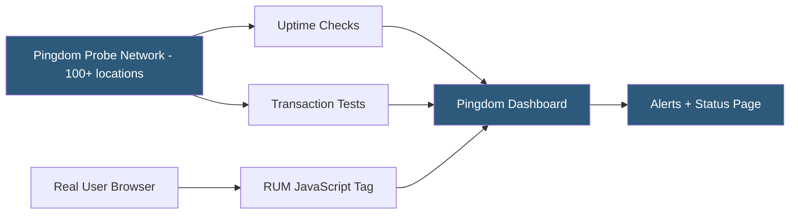

**Category:** Monitoring & Observability SaaS
**Difficulty:** Beginner
**Reading time:** 5 min read

---

Pingdom (owned by SolarWinds) is a website performance and uptime monitoring service that tests availability and response times from over 100 global probe locations. Beyond basic uptime checks, Pingdom provides page speed monitoring using waterfall analysis, real user monitoring (RUM) for browser performance metrics, and transaction monitoring for testing multi-step user flows.

- **Uptime check** — HTTP/HTTPS ping test measuring availability and response time from selected probe locations
- **Waterfall report** — per-resource load time breakdown for a full page request
- **Transaction test** — scripted multi-step browser interaction (login, add-to-cart, checkout)
- **Real User Monitoring (RUM)** — client-side JavaScript tag measuring real visitor page load times
- **Root cause analysis** — automated report mapping an outage to its causal resource failure
- **Alert policies** — configurable rules controlling when and how notifications are sent
- **Public status page** — Pingdom-hosted page showing current monitor status and uptime history

Pingdom operates probe servers in over 100 cities worldwide. Each uptime check dispatches HTTP/HTTPS requests from the configured probe locations at 1-minute intervals, recording response time and HTTP status code. When a check fails from multiple locations simultaneously, an outage is declared and alert contacts receive notifications. Response time graphs show performance from each probe region independently, making it possible to detect regional CDN or DNS issues.

The page speed test extends basic HTTP checks to a full browser-level page load, requesting all referenced assets (scripts, stylesheets, images, fonts) and producing a waterfall chart showing load order, size, and duration for each resource. This identifies specific third-party scripts, slow CDN zones, or uncached assets contributing to page weight.

Transaction monitoring uses a headless browser to execute scripted multi-step flows — the engineer defines a sequence of actions (navigate to URL, fill form field, click button, assert text present) and Pingdom executes the script from probe locations at regular intervals. Failed transactions trigger alerts, enabling detection of broken checkout flows or authentication failures before users report them.

RUM is added to pages with a lightweight JavaScript snippet. The tag measures performance from real visitor browsers using the Navigation Timing API, reporting TTFB, DOM interactive, and full page load times segmented by country, browser, device type, and ISP. RUM data shows performance as real users experience it, complementing the synthetic probe checks.

- Monitoring website availability from customer-relevant geographic regions
- Detecting CDN performance degradation with per-probe response time graphs
- Testing end-to-end checkout flows every 5 minutes to catch regressions
- Measuring real user page load times by geographic market
- Publishing an uptime status page for SLA reporting

| Advantage | Disadvantage |
|-----------|--------------|
| 100+ probe locations for global coverage | Higher cost compared to simpler tools like UptimeRobot |
| Transaction testing for multi-step flow validation | Transaction script writing requires technical skill |
| Real user monitoring alongside synthetic checks | RUM data can be noisy without traffic volume |
| Waterfall analysis for page performance debugging | No APM or log management features |

- [UptimeRobot Monitoring Service](uptimerobot-monitoring-service.md)
- [StatusCake Uptime Monitoring](statuscake-uptime-monitoring.md)
- [Datadog Synthetic Monitoring](datadog-synthetic-monitoring.md)

---
*Part of the [Monitoring & Observability SaaS](index.md) category · [Back to Master Index](../../index.md)*
