**Category:** Monitoring & Observability SaaS
**Difficulty:** Beginner
**Reading time:** 5 min read

---

Rollbar is a real-time error monitoring platform that captures exceptions across web, mobile, and server applications with automatic deduplication, person tracking, and deploy-aware grouping. It integrates with CI/CD pipelines to surface regressions at deployment time and routes issues to engineering teams through Slack, PagerDuty, Jira, and GitHub integrations.

- **Item** — Rollbar's term for a deduplicated error issue aggregating similar occurrences
- **Occurrence** — a single error event contributing to an item
- **Telemetry** — breadcrumb trail of DOM events, XHR calls, and console logs preceding an error
- **Deploy tracking** — associating error spikes with specific deployment revisions
- **Person tracking** — linking errors to authenticated user identities for impact analysis
- **Fingerprinting** — configurable logic for grouping error occurrences into items
- **Active releases** — view of which errors were introduced or resolved in each deployment

```mermaid
graph LR
    A[Application Error] --> B[Rollbar SDK]
    B --> C[Enrichment + Telemetry]
    C --> D[Rollbar API]
    D --> E[Fingerprint + Deduplicate]
    E --> F[Item Created/Updated]
    F --> G[Alert Routing]
    G --> H[Slack / PagerDuty / Jira]
    style A fill:#2d5a7a,color:#fff
    style D fill:#2d5a7a,color:#fff
    style F fill:#2d5a7a,color:#fff
```

Rollbar SDKs are available for JavaScript, Python, Ruby, PHP, Java, .NET, Go, and mobile platforms. When an unhandled exception is thrown, the SDK captures the stack trace, runtime context, request metadata (URL, method, headers), and custom payload data configured by the developer. A telemetry buffer of the preceding browser or application events — DOM interactions, AJAX calls, navigation — is included to provide context for reproducing the error.

The payload is sent to Rollbar's API, where it passes through a data pipeline that applies fingerprinting rules. Default fingerprinting uses exception class and the first few normalized stack frames; developers can customize rules with JavaScript expressions to merge or split groupings. Duplicate occurrences increment the item's counter and update the "last seen" timestamp without creating noise.

Person tracking attaches error occurrences to user records when SDK initialization includes a person object (id, email, username). This enables the "people affected" count per item and allows querying errors by specific user, which is valuable for enterprise customer support.

Deploy tracking integrates with CI/CD pipelines via a POST to the Rollbar deploy API at release time. Rollbar then automatically highlights items that first appeared or dramatically increased after each deploy, making regression detection a standard part of the release process.

- Monitoring production error rates across multiple environments
- Detecting regressions immediately after deployments
- Identifying which customers are affected by a specific bug
- Routing critical errors to on-call engineers via PagerDuty integration
- Setting error rate thresholds to block deployments in CI/CD

| Advantage | Disadvantage |
|-----------|--------------|
| Deploy-aware grouping links errors to releases | Fingerprinting customization has a learning curve |
| Person tracking for customer impact analysis | Less comprehensive APM than Datadog or New Relic |
| Real-time error rate monitoring per deployment | SDK telemetry adds slight payload overhead |
| Strong CI/CD pipeline integration | Limited distributed tracing capabilities |

- [Sentry Error Tracking](sentry-error-tracking.md)
- [Bugsnag Error Detection](bugsnag-error-detection.md)
- [Datadog Log Management](datadog-log-management.md)

---
*Part of the [Monitoring & Observability SaaS](index.md) category · [Back to Master Index](../../index.md)*
