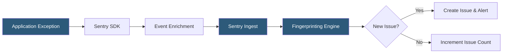

**Category:** Monitoring & Observability SaaS
**Difficulty:** Beginner
**Reading time:** 5 min read

---

Sentry is an open-source error monitoring platform that captures exceptions, stack traces, and contextual metadata from applications in real time. It aggregates errors into issues, deduplicates recurring exceptions, and routes alerts to the responsible team. Sentry supports over 100 platforms and integrates directly into developer workflows through GitHub, Jira, and Slack.

- **Issue** — a grouped collection of similar error events sharing a fingerprint
- **Event** — a single error occurrence with full stack trace and context
- **Fingerprinting** — algorithm that groups similar errors into the same issue
- **DSN (Data Source Name)** — the SDK connection string pointing events to a Sentry project
- **Release tracking** — associating errors with specific deployment versions
- **Breadcrumbs** — chronological trail of actions preceding an error
- **Suspect commit** — the source code change Sentry identifies as likely introducing the error

Sentry SDKs are lightweight libraries embedded in application code. When an unhandled exception or a manually captured error occurs, the SDK constructs an event payload containing the exception type, message, full stack trace, and contextual data such as the operating system, runtime version, request URL, user ID, and any custom tags set by the developer.

Events are transmitted asynchronously to Sentry's ingest pipeline, where they are enriched with source maps for JavaScript applications (translating minified traces to readable code), processed through configurable data scrubbing rules to remove PII, and then fingerprinted. The fingerprinting algorithm groups events by exception type, module path, and frame context to form issues.

When a new unique issue is detected, Sentry fires configured alerts (email, Slack, PagerDuty, webhooks). For regressions — issues that were previously resolved but recur in a new release — Sentry creates a regression alert. Release tracking, enabled by uploading release metadata and source maps at deploy time, allows Sentry to show exactly when an error first appeared and compute the percentage of sessions affected. Engineers can assign issues to team members, set priority, and link directly to the offending commit.

- Catching production exceptions before users report them
- Tracking error rates across releases to validate deployments
- Identifying the specific commit that introduced a regression
- Monitoring error budgets for SLO compliance
- Correlating frontend JavaScript errors with backend API failures

| Advantage | Disadvantage |
|-----------|--------------|
| Supports 100+ languages and frameworks | Event volume costs can escalate quickly |
| Real-time alerting with smart deduplication | Source map management adds deployment complexity |
| Native integration with GitHub for suspect commits | Aggressive sampling may miss infrequent errors |
| Self-hosted option available (open source) | Default fingerprinting may group unrelated errors |

- [Sentry Performance Monitoring](sentry-performance-monitoring.md)
- [Sentry Session Replay](sentry-session-replay.md)
- [Rollbar Error Monitoring](rollbar-error-monitoring.md)

---
*Part of the [Monitoring & Observability SaaS](index.md) category · [Back to Master Index](../../index.md)*
