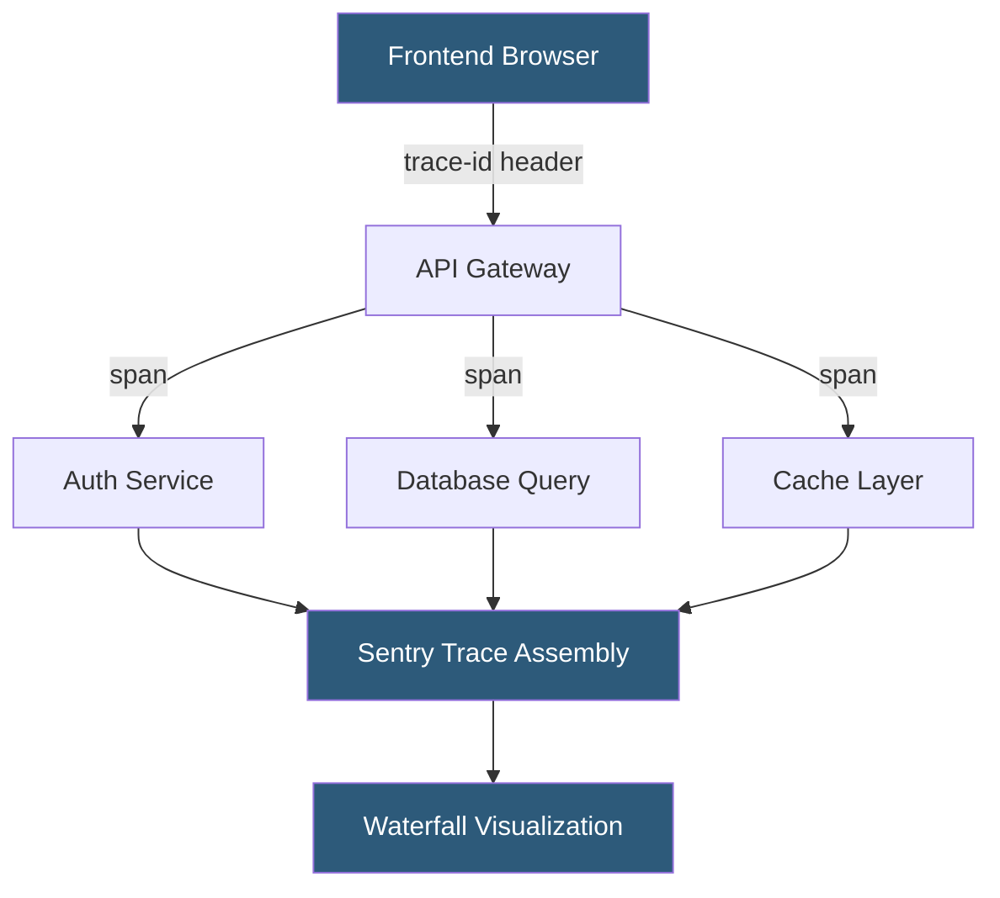

**Category:** Monitoring & Observability SaaS
**Difficulty:** Intermediate
**Reading time:** 6 min read

---

Sentry Performance Monitoring extends error tracking with distributed tracing, transaction profiling, and web vitals measurement. It instruments application code to produce spans that form traces across service boundaries, enabling engineers to identify slow database queries, external API calls, and rendering bottlenecks without switching tools.

- **Transaction** — a single unit of work representing a request, page load, or background job
- **Span** — a timed operation within a transaction (SQL query, HTTP call, render cycle)
- **Trace** — a connected chain of transactions across multiple services
- **P75 / P95 / P99** — latency percentiles used to characterize performance distribution
- **Apdex score** — ratio of satisfactory to tolerable to frustrated user interactions
- **Web Vitals** — browser performance metrics: LCP, FID, CLS (Core Web Vitals)
- **N+1 detection** — automatic identification of repeated similar queries in a single request

Sentry's SDK automatically instruments popular frameworks (Django, Rails, Express, Next.js) to wrap inbound HTTP handlers as transactions. Each transaction is assigned a trace ID propagated through outbound HTTP headers and message queues so that all work related to a single user request is stitched together into a distributed trace.

Within a transaction, the SDK creates spans for database queries (via ORM hooks), HTTP client calls, cache operations, and template rendering. Each span records start time, duration, operation type, and descriptive data (e.g., the SQL statement). These are batched and sent to Sentry at transaction completion.

For browser applications, the SDK captures Web Vitals (LCP, FID, CLS, TTFB) and user interactions as spans within page-load and navigation transactions. Sentry's frontend performance dashboard aggregates these into per-page P75 scores, enabling prioritization of the slowest user journeys.

Performance issues are surfaced automatically: N+1 query patterns trigger dedicated detectors, slow DB queries above configurable thresholds are flagged, and consecutive DB calls within the same span tree are highlighted. Engineers can filter transactions by release version, region, or user segment to isolate regressions. All performance data is stored alongside error data, so a single trace can show both the slow span and any exceptions thrown during that request.

- Identifying database query bottlenecks introduced by a new ORM query
- Measuring page load performance by geographic region
- Tracing slow checkout flows across frontend, API, and payment services
- Detecting N+1 queries from ORM lazy loading
- Establishing performance baselines for deployment regression detection

| Advantage | Disadvantage |
|-----------|--------------|
| Unified errors and traces in one platform | High-traffic services require aggressive sampling |
| Automatic N+1 and slow query detection | Less feature-rich than dedicated APM tools for complex traces |
| Web Vitals integrated with backend tracing | SDK instrumentation adds small latency overhead |
| No separate tool required for full-stack visibility | Trace retention period limited on lower-tier plans |

- [Sentry Error Tracking](sentry-error-tracking.md)
- [Sentry Session Replay](sentry-session-replay.md)
- [Datadog APM (Application Performance)](datadog-apm-application-performance.md)

---
*Part of the [Monitoring & Observability SaaS](index.md) category · [Back to Master Index](../../index.md)*
