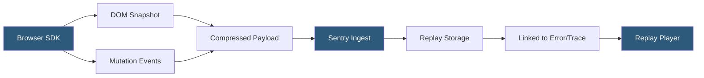

**Category:** Monitoring & Observability SaaS
**Difficulty:** Intermediate
**Reading time:** 5 min read

---

Sentry Session Replay captures pixel-accurate reproductions of user browser sessions using DOM mutation recording, allowing developers to watch exactly what a user experienced when an error occurred. Replays are automatically linked to errors and performance traces, eliminating the need to reproduce bugs manually. Privacy masking ensures sensitive form fields and text are redacted before transmission.

- **DOM snapshot** — full serialization of the page DOM captured at session start
- **Mutation recording** — incremental recording of DOM changes using MutationObserver
- **rrweb** — open-source library underlying Sentry's replay capture mechanism
- **Session sampling** — configurable rate controlling what percentage of sessions are recorded
- **Error sampling** — higher sampling rate applied when an error is detected in a session
- **Privacy masking** — automatic redaction of input fields, text nodes, and images
- **Replay breadcrumbs** — user clicks, navigation events, and console logs synchronized with replay

Sentry Session Replay uses the rrweb library to record browser sessions as a compact stream of DOM events. At session start, the SDK takes a full snapshot of the serialized DOM tree and then registers a MutationObserver to capture incremental changes — element additions, attribute updates, text modifications — as the user interacts with the page.

User interactions (mouse clicks, keyboard input, scroll events) and network requests are recorded as breadcrumbs synchronized to the event timeline. Console logs and JavaScript errors are also captured and overlaid on the replay. All captured data is compressed and buffered in memory, then flushed to Sentry's API in chunks to minimize network overhead.

Privacy is controlled through masking rules. By default, all text content and input values are replaced with placeholder characters before leaving the browser. Developers can configure element-level allow lists or deny lists to tune the balance between replay fidelity and data sensitivity compliance (GDPR, CCPA).

When an error event is captured by the Sentry SDK in the same session, the replay is flagged as an "error replay" and retained at a higher sampling rate. Engineers viewing an error in Sentry's issue detail panel see a direct link to the corresponding replay, where they can scrub to the exact moment of the crash and observe every user action that preceded it.

- Reproducing intermittent UI bugs that are difficult to replicate locally
- Understanding user journeys that lead to checkout abandonment before an error
- Validating that UI interactions match intended behavior after a release
- Providing customer support with visual context for reported issues
- Auditing accessibility and usability alongside error data

| Advantage | Disadvantage |
|-----------|--------------|
| Direct error-to-replay linkage eliminates guesswork | Large sessions generate significant payload volume |
| Privacy masking built-in | Canvas and WebGL content not captured |
| No separate tooling required — unified in Sentry | Replay sampling reduces coverage for low-traffic apps |
| Open-source rrweb foundation is auditable | Mobile app replay requires separate SDK |

- [Sentry Error Tracking](sentry-error-tracking.md)
- [Sentry Performance Monitoring](sentry-performance-monitoring.md)
- [LogRocket Session Recording](logrocket-session-recording.md)

---
*Part of the [Monitoring & Observability SaaS](index.md) category · [Back to Master Index](../../index.md)*
