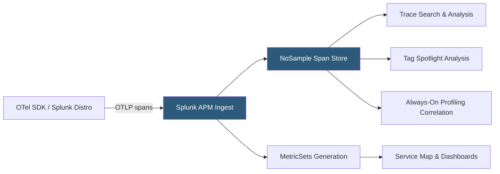

**Category:** Monitoring & Observability SaaS
**Difficulty:** Intermediate
**Reading time:** 6 min read

---

Splunk APM (formerly SignalFx APM) delivers NoSample full-fidelity distributed tracing and AI-driven service analytics by capturing every span from every request without sampling. Built on OpenTelemetry, it provides service dependency maps, error and latency breakdowns, and Tag Spotlight analysis to accelerate root cause identification.

- **NoSample Tracing** — Splunk APM's architecture retaining 100% of trace spans for complete performance visibility rather than statistical sampling
- **Service Map** — Auto-generated dependency topology showing request flow, error rates, and P99 latency between services
- **Tag Spotlight** — Feature that identifies which tag value combinations are statistically correlated with elevated error or latency rates
- **Business Workflow** — Named multi-service trace path corresponding to a user-facing transaction (e.g., "checkout") for end-to-end SLO tracking
- **MetricSets** — Pre-aggregated metric dimensions generated from trace data for efficient dashboard queries without full trace scan
- **Always-On Profiling** — Continuous CPU and memory profiling linked to trace spans without manual profiling sessions
- **Span Tags** — Key-value metadata attached to spans enabling Tag Spotlight correlation and custom filtering
- **OpenTelemetry** — Splunk APM natively ingests OTLP traces, avoiding vendor-specific SDK instrumentation requirements

Splunk APM ingests trace data via OTLP endpoints, making it compatible with any OpenTelemetry-instrumented service. Splunk provides pre-configured OpenTelemetry distro packages for Java, Python, Node.js, .NET, and Go that add Splunk-specific attributes and enable AlwaysOn Profiling without additional SDK configuration.

NoSample tracing stores every span in Splunk APM's purpose-built trace data store. This enables accurate tail latency percentiles (P99, P99.9) that sampling-based systems undercount, and ensures rare error conditions—affecting 0.01% of traffic—appear in trace search without requiring special sampling rules. The storage tier uses columnar compression to make 100% trace retention economically viable.

MetricSets are a parallel pipeline that processes incoming spans and pre-aggregates service-level RED metrics (Rate, Errors, Duration) by configurable dimension combinations (service, endpoint, region, version). These pre-aggregated metrics power real-time Service Map rendering and dashboard queries without requiring full trace scans, ensuring the UI remains responsive even at high ingest rates.

Tag Spotlight performs statistical correlation analysis on span tags against error and latency outcomes. For each tag key (e.g., `http.url`, `db.name`, `customer_tier`), it identifies which values are over-represented in slow or error spans compared to baseline. This surfaces actionable insights like "the `/api/checkout` endpoint has 8× higher error rate when `payment_provider=legacy`" without requiring the engineer to know which tags to investigate.

AlwaysOn Profiling runs a statistical CPU profiler in the service process and correlates captured stack frames to the concurrent trace spans, enabling precise identification of which code paths are consuming CPU within a slow span.

- Using Tag Spotlight to discover that 90% of 5xx errors correlate with a specific database replica tag after a failover event
- Querying the complete trace for a P99.9 slow request that sampled APM would never have retained
- Tracking Business Workflow SLOs for checkout end-to-end across 12 microservices on a single dashboard
- Using AlwaysOn Profiling to identify an inefficient JSON serializer consuming 40% of span execution time
- Migrating from a proprietary APM agent to OpenTelemetry instrumentation while maintaining full Splunk APM functionality

| Advantage | Disadvantage |
|-----------|--------------|
| 100% NoSample tracing provides accurate tail latency data and rare error capture | Full-fidelity trace storage is expensive at high request rates; requires retention policy management |
| OpenTelemetry-native ingestion reduces vendor lock-in and leverages community instrumentation | OTel auto-instrumentation coverage varies by language; some frameworks require manual span creation |
| Tag Spotlight eliminates need to manually formulate hypotheses during incident investigation | MetricSets dimension cardinality limits apply; unlimited high-cardinality tag combinations increase cost |
| AlwaysOn Profiling links code hotspots to traces without separate profiling tooling | Profiling adds ~2% CPU overhead; validation required for CPU-bound workloads |

- [Splunk Cloud Platform](splunk-cloud-platform.md)
- [Splunk Infrastructure Monitoring](splunk-infrastructure-monitoring.md)
- [Datadog APM (Application Performance)](datadog-apm-application-performance.md)

---
*Part of the [Monitoring & Observability SaaS](index.md) category · [Back to Master Index](../../index.md)*
