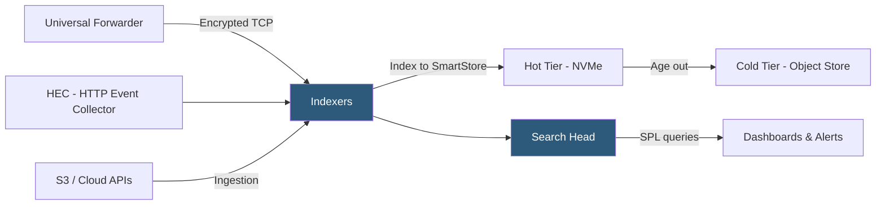

**Category:** Monitoring & Observability SaaS
**Difficulty:** Advanced
**Reading time:** 7 min read

---

Splunk Cloud Platform is a managed SaaS version of Splunk's data platform that ingests machine-generated data—logs, metrics, events, and traces—at petabyte scale, providing powerful search, correlation, and analytics through the Search Processing Language (SPL). It serves both IT operations and security use cases from a single data store.

- **SPL (Search Processing Language)** — Splunk's proprietary query language using a pipeline syntax to search, transform, and visualize event data
- **Index** — Partitioned data store in Splunk organizing events by time with configurable retention and access controls
- **Forwarder** — Lightweight agent (Universal Forwarder or Heavy Forwarder) deployed on data sources to collect and forward data to Splunk indexers
- **Source Type** — Classification label applied to incoming data that controls field extraction, timestamp parsing, and event boundary detection
- **Lookup** — Reference table joined at query time to enrich events with external data (e.g., IP-to-hostname mapping)
- **CIM (Common Information Model)** — Splunk's normalized data model standardizing field names across different source types for consistent searches
- **Saved Search / Alert** — Recurring SPL query scheduled to detect conditions and trigger notifications or automated actions
- **SmartStore** — Storage tier architecture separating hot (local NVMe) and cold (S3/GCS/Azure Blob) data to reduce indexer storage costs

Splunk Cloud Platform operates as a fully managed deployment where Splunk manages indexer and search head infrastructure, capacity scaling, and upgrades. Data enters through Universal Forwarders deployed on source hosts, the HTTP Event Collector (HEC) for programmatic ingestion, or cloud-native inputs polling AWS S3, CloudTrail, and similar sources.

Universal Forwarders are lightweight agents (~3MB binary) that monitor files and network ports, apply basic filtering, and forward data to indexers over an encrypted TCP connection with built-in load balancing. The Heavy Forwarder variant can parse events, apply CIM field transformations, and route data to different indexes before forwarding—useful for data enrichment pipelines.

Indexers parse incoming data streams by source type rules that define field extraction patterns, timestamp formats, and event boundary characters. Extracted fields are stored in the index alongside the raw event text, enabling both structured field searches and full-text search. The SmartStore architecture keeps recently ingested hot data on fast local NVMe storage for low-latency queries while automatically migrating aged data to cheaper object storage (S3), significantly reducing total storage cost at scale.

SPL queries run on the search head tier, which distributes work across indexers and aggregates results. SPL's pipeline syntax (search → filter → transform → visualize) is flexible but has a steep learning curve. Common patterns include `stats count by field` for aggregation, `eval` for computed fields, `lookup` for enrichment, and `transaction` for event grouping. Dashboards are built from saved SPL searches with scheduled refresh intervals.

- Correlating application logs, network device syslogs, and AWS CloudTrail events in a single SPL search during a security incident
- Building operational dashboards that join application error rates with infrastructure CPU and network metrics
- Creating automated alert searches that page on-call when error rates exceed baseline in any environment tag
- Using SmartStore to maintain 2 years of log retention at fraction of all-NVMe storage cost
- Normalizing AWS, Azure, and on-premises log formats to CIM fields for unified SIEM correlation rules

| Advantage | Disadvantage |
|-----------|--------------|
| SPL is extremely flexible for ad-hoc investigation of complex multi-source correlations | SPL learning curve is steep; complex queries are difficult to read and maintain |
| Scales to petabytes with SmartStore object storage tiering | Ingest-based pricing (GB/day) is expensive at scale without aggressive filtering |
| Dual IT and security use cases from one platform reduces tool sprawl | Managed cloud platform has less customization flexibility than self-hosted Splunk Enterprise |
| Universal Forwarder supports virtually any log source with file monitoring and network inputs | CIM normalization requires per-source-type configuration work; inconsistent out-of-the-box field mapping |

- [Splunk APM](splunk-apm.md)
- [Splunk Infrastructure Monitoring](splunk-infrastructure-monitoring.md)
- [Datadog Log Management](datadog-log-management.md)

---
*Part of the [Monitoring & Observability SaaS](index.md) category · [Back to Master Index](../../index.md)*
