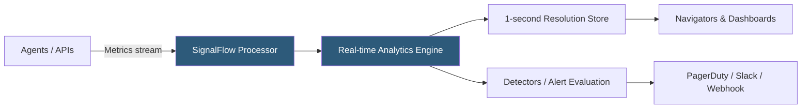

**Category:** Monitoring & Observability SaaS
**Difficulty:** Intermediate
**Reading time:** 5 min read

---

Splunk Infrastructure Monitoring (formerly SignalFx) is a streaming metrics platform designed for real-time infrastructure and cloud monitoring at high resolution. Its SignalFlow analytics engine processes metrics at one-second granularity, enabling immediate anomaly detection and alerting that coarser-resolution platforms cannot match.

- **SignalFlow** — Splunk's streaming computation language for defining real-time metric analytics, transformations, and alert conditions
- **MTS (Metric Time Series)** — Individual metric dimension combination (e.g., `cpu.utilization{host=web01,env=prod}`) as the billing unit
- **Resolution** — Metric collection interval; Splunk Infrastructure Monitoring supports one-second resolution for precise spike detection
- **Detector** — Alert definition created using SignalFlow analytics that evaluates metric streams and fires notifications
- **Navigator** — Pre-built infrastructure dashboards organized by service type (EC2, Kubernetes, RDS) using correlated metrics
- **AutoDetect** — Pre-built detectors covering common infrastructure failure patterns that activate automatically on new integrations
- **Integration** — Cloud provider or technology connector (AWS CloudWatch, GCP, Azure, Kubernetes) that imports metrics into the platform
- **Related Content** — Contextual links in dashboards that surface correlated APM traces and log records for the selected infrastructure entity

Splunk Infrastructure Monitoring ingests metrics through multiple paths: the Splunk OpenTelemetry Collector deployed on hosts, cloud provider API integrations polling CloudWatch or Azure Monitor, and direct client libraries. All metrics stream into the SignalFlow processing engine, which evaluates analytics computations in real time rather than batch-processing historical data.

SignalFlow programs define how metrics are transformed, combined, and evaluated. A simple detector might compute a five-minute rolling mean of CPU utilization and alert when it exceeds 85%. More complex programs join metrics from multiple services, apply statistical anomaly detection using standard deviations from a historical mean, or calculate derived metrics like cache hit ratios from raw hit and miss counters. SignalFlow runs these computations continuously on the incoming data stream rather than re-querying stored data.

The one-second metric resolution is a key differentiator. Most platforms aggregate metrics at 60-second intervals, which can miss sub-minute spikes in CPU, memory, or network utilization. Splunk Infrastructure Monitoring retains one-second data for a configurable window (typically 8 days) before rolling up to coarser resolutions, enabling forensic analysis of transient spikes that standard monitoring would average away.

Navigators provide pre-built dashboard templates for each infrastructure type. The Kubernetes Navigator, for example, surfaces cluster, namespace, node, and pod hierarchy views with correlated metrics at each level, linked to container logs and APM traces for the selected workload—providing a starting point without custom dashboard creation.

- Detecting a 15-second CPU spike on a payment processor caused by a lock contention event that 60-second metrics would smooth out
- Using SignalFlow to alert when a Kubernetes node's allocatable CPU drops below 20% due to resource request growth
- Monitoring AWS Lambda function duration p99 with one-second resolution to catch cold start latency spikes
- Using AutoDetect to immediately receive detectors covering common EC2 and RDS failure patterns after connecting an AWS integration
- Correlating a host metric degradation to a slow APM trace via Related Content links without switching tools

| Advantage | Disadvantage |
|-----------|--------------|
| One-second metric resolution captures transient spikes invisible in coarser aggregations | Per-MTS pricing scales with metric cardinality; high-tag-cardinality environments require careful management |
| SignalFlow streaming analytics provides lower detection latency than batch-query alerting | SignalFlow is proprietary; logic must be rewritten if migrating to Prometheus/Grafana |
| Navigators provide immediate value for common infrastructure types without custom configuration | Navigators are opinionated; customization requires SignalFlow knowledge |
| AutoDetect reduces time-to-first-alert after a new cloud integration is connected | AutoDetect detectors may require threshold tuning for environments with unusual baseline patterns |

- [Splunk APM](splunk-apm.md)
- [Splunk Cloud Platform](splunk-cloud-platform.md)
- [Grafana Mimir for Metrics](grafana-mimir-for-metrics.md)

---
*Part of the [Monitoring & Observability SaaS](index.md) category · [Back to Master Index](../../index.md)*
